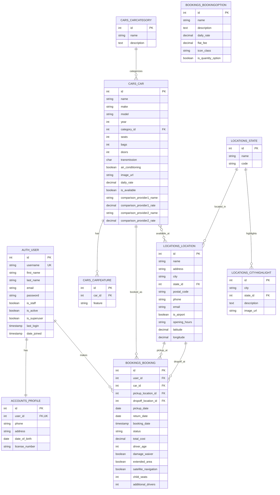

# Rush Car Rental 设计文档

## 目录

1. [系统架构](#系统架构)
2. [代码设计](#代码设计)
3. [数据库设计](#数据库设计)
4. [用户界面设计](#用户界面设计)
5. [关键功能实现](#关键功能实现)
6. [未来迭代方向](#未来迭代方向)

## 系统架构

Rush Car Rental采用了经典的Django MVT (Model-View-Template)架构，结合PostgreSQL数据库和Bootstrap前端框架构建。

### 技术栈

- **后端框架**: Django 4.x
- **数据库**: PostgreSQL
- **前端框架**: Bootstrap 5.x
- **支付处理**: Stripe API
- **认证系统**: Django内置认证系统扩展
- **响应式设计**: 移动优先的自适应布局

### 系统组件

系统被拆分为以下几个主要Django应用:

1. **accounts**: 用户账户和个人资料管理
2. **bookings**: 预订处理和管理
3. **cars**: 车辆信息管理
4. **locations**: 租赁地点管理
5. **pages**: 静态信息页面

## 代码设计

### 模块化设计

系统采用高度模块化的设计，每个Django应用负责特定的业务领域:

#### accounts应用

- 处理用户注册、登录和个人资料管理
- 通过Django信号系统自动创建用户个人资料
- 实现了个人资料更新和预订历史查看功能

```python
# 通过信号自动创建用户个人资料
@receiver(post_save, sender=User)
def create_profile(sender, instance, created, **kwargs):
    if created:
        Profile.objects.create(user=instance)
```

#### bookings应用

- 实现了完整的多步骤预订流程
- 处理额外选项的添加和总价计算
- 集成Stripe支付处理

预订流程设计:
1. 车辆选择 (`create_booking`)
2. 添加额外选项 (`add_options`)
3. 确认预订 (`confirm_booking`)
4. 支付处理 (`payment` 和 `process_payment`)
5. 预订确认 (`booking_success`)

#### cars应用

- 车辆信息管理和展示
- 高级搜索功能
- 价格比较功能

#### locations应用

- 租赁地点管理
- 城市亮点展示

#### pages应用

- 静态信息页面（租赁条件、退款政策等）

### 关键设计模式

1. **表单处理模式**: 使用Django表单系统进行数据验证和处理

```python
class BookingForm(forms.ModelForm):
    class Meta:
        model = Booking
        fields = ['pickup_location', 'dropoff_location', 'pickup_date', 'return_date', 'driver_age']
        widgets = {
            'pickup_date': forms.DateInput(attrs={'type': 'date'}),
            'return_date': forms.DateInput(attrs={'type': 'date'}),
            'driver_age': forms.NumberInput(attrs={'min': 18, 'max': 99}),
        }
```

2. **会话处理模式**: 使用Django会话存储临时预订信息

```python
# 在会话中存储临时预订信息
request.session['temp_booking'] = {
    'car_id': car.id,
    'pickup_location_id': form.cleaned_data['pickup_location'].id,
    'dropoff_location_id': form.cleaned_data['dropoff_location'].id,
    'pickup_date': form.cleaned_data['pickup_date'].isoformat(),
    'return_date': form.cleaned_data['return_date'].isoformat(),
    'driver_age': form.cleaned_data['driver_age'],
    'duration_days': duration_days,
    'base_cost': str(base_cost),
}
```

3. **模板继承模式**: 使用基础模板和扩展模板结构

```html



<!-- 特定页面内容 -->

```

4. **模型关联模式**: 使用Django ORM建立模型关联

```python
class Booking(models.Model):
    user = models.ForeignKey(User, on_delete=models.CASCADE)
    car = models.ForeignKey(Car, on_delete=models.CASCADE)
    pickup_location = models.ForeignKey(Location, on_delete=models.CASCADE, related_name='pickup_bookings')
    dropoff_location = models.ForeignKey(Location, on_delete=models.CASCADE, related_name='dropoff_bookings')
    # ...其他字段
```

## 数据库设计

### ER图（概念）

以下是使用传统格式展示的ER图：

```
User(id, username, email, password, first_name, last_name)
   |
   | 1:1
   v
Profile(id, user_id, phone, address, date_of_birth, license_number)
   |
   | 1:n
   v
Booking(id, user_id, car_id, pickup_location_id, dropoff_location_id, 
        pickup_date, return_date, booking_date, status, total_cost, 
        driver_age, damage_waiver, extended_area, satellite_navigation, 
        child_seats, additional_drivers)
        |
        | n:1
        v
Car(id, name, make, model, year, category_id, seats, bags, doors, 
    transmission, air_conditioning, image_url, daily_rate, is_available,
    comparison_provider1_name, comparison_provider1_rate,
    comparison_provider2_name, comparison_provider2_rate)
    |
    | n:1
    v
CarCategory(id, name, description)
    |
    | m:n
    v
Location(id, name, address, city, state_id, postal_code, phone, email,
         is_airport, opening_hours, latitude, longitude)
         |
         | n:1
         v
State(id, name, code)
```

### Mermaid ER图

以下使用Mermaid语法描述的ER图提供了更直观的数据库关系表示：



### 主要数据模型

#### 用户和个人资料

```python
# Django内置User模型 + 自定义Profile扩展
class Profile(models.Model):
    user = models.OneToOneField(User, on_delete=models.CASCADE)
    phone = models.CharField(max_length=15, blank=True)
    address = models.CharField(max_length=255, blank=True)
    date_of_birth = models.DateField(null=True, blank=True)
    license_number = models.CharField(max_length=30, blank=True)
```

#### 车辆相关模型

```python
class CarCategory(models.Model):
    name = models.CharField(max_length=50)
    description = models.TextField(blank=True)

class Car(models.Model):
    TRANSMISSION_CHOICES = [
        ('A', 'Automatic'),
        ('M', 'Manual'),
    ]
    name = models.CharField(max_length=100)
    make = models.CharField(max_length=50)
    model = models.CharField(max_length=50)
    year = models.PositiveIntegerField()
    category = models.ForeignKey(CarCategory, on_delete=models.CASCADE)
    seats = models.PositiveIntegerField()
    bags = models.PositiveIntegerField()
    doors = models.PositiveIntegerField()
    transmission = models.CharField(max_length=1, choices=TRANSMISSION_CHOICES)
    air_conditioning = models.BooleanField(default=True)
    image_url = models.URLField()
    daily_rate = models.DecimalField(max_digits=8, decimal_places=2)
    is_available = models.BooleanField(default=True)
    locations = models.ManyToManyField(Location, related_name='available_cars')
    # 价格比较字段
    comparison_provider1_name = models.CharField(max_length=50, blank=True)
    comparison_provider1_rate = models.DecimalField(max_digits=8, decimal_places=2, null=True, blank=True)
    comparison_provider2_name = models.CharField(max_length=50, blank=True)
    comparison_provider2_rate = models.DecimalField(max_digits=8, decimal_places=2, null=True, blank=True)
```

#### 地点相关模型

```python
class State(models.Model):
    name = models.CharField(max_length=100)
    code = models.CharField(max_length=10)

class Location(models.Model):
    name = models.CharField(max_length=100)
    address = models.CharField(max_length=255)
    city = models.CharField(max_length=100)
    state = models.ForeignKey(State, on_delete=models.CASCADE)
    postal_code = models.CharField(max_length=20)
    phone = models.CharField(max_length=20, blank=True)
    email = models.EmailField(blank=True)
    is_airport = models.BooleanField(default=False)
    opening_hours = models.CharField(max_length=255, default='Monday-Friday: 8AM-6PM, Saturday: 9AM-5PM, Sunday: Closed')
    latitude = models.DecimalField(max_digits=9, decimal_places=6, null=True, blank=True)
    longitude = models.DecimalField(max_digits=9, decimal_places=6, null=True, blank=True)
```

#### 预订相关模型

```python
class BookingOption(models.Model):
    name = models.CharField(max_length=100)
    description = models.TextField()
    daily_rate = models.DecimalField(max_digits=8, decimal_places=2, null=True, blank=True)
    flat_fee = models.DecimalField(max_digits=8, decimal_places=2, null=True, blank=True)
    icon_class = models.CharField(max_length=50, default="fas fa-car")
    is_quantity_option = models.BooleanField(default=False)

class Booking(models.Model):
    STATUS_CHOICES = [
        ('pending', 'Pending'),
        ('confirmed', 'Confirmed'),
        ('cancelled', 'Cancelled'),
        ('completed', 'Completed'),
    ]
    
    user = models.ForeignKey(User, on_delete=models.CASCADE)
    car = models.ForeignKey(Car, on_delete=models.CASCADE)
    pickup_location = models.ForeignKey(Location, on_delete=models.CASCADE, related_name='pickup_bookings')
    dropoff_location = models.ForeignKey(Location, on_delete=models.CASCADE, related_name='dropoff_bookings')
    pickup_date = models.DateField()
    return_date = models.DateField()
    booking_date = models.DateTimeField(auto_now_add=True)
    status = models.CharField(max_length=20, choices=STATUS_CHOICES, default='pending')
    total_cost = models.DecimalField(max_digits=10, decimal_places=2)
    driver_age = models.PositiveIntegerField()
    
    # 额外选项
    damage_waiver = models.BooleanField(default=False)
    extended_area = models.BooleanField(default=False)
    satellite_navigation = models.BooleanField(default=False)
    child_seats = models.PositiveIntegerField(default=0)
    additional_drivers = models.PositiveIntegerField(default=0)
```

### 数据关系

- User 1:1 Profile (一对一): 每个用户有一个个人资料
- User 1:n Booking (一对多): 一个用户可以有多个预订
- Car 1:n Booking (一对多): 一辆车可以有多个预订（不同时间段）
- Location 1:n Booking (一对多): 一个地点可以作为多个预订的取车/还车点
- State 1:n Location (一对多): 一个州/省可以有多个租赁地点
- CarCategory 1:n Car (一对多): 一个车辆类别可以有多辆车
- Car m:n Location (多对多): 一辆车可以在多个地点提供，一个地点可以提供多辆车

## 用户界面设计

### 设计风格

- **主色调**: 黄色、黑色和白色，符合品牌形象
- **设计理念**: 简洁、现代、用户友好
- **响应式设计**: 适应不同屏幕尺寸的设备

### 主要页面

1. **首页**:
   - 醒目的搜索表单
   - 特色车辆展示
   - 热门城市展示

2. **车辆列表**:
   - 基于搜索条件的车辆列表
   - 筛选和排序功能
   - 车辆卡片展示关键信息

3. **车辆详情**:
   - 详细的车辆规格和功能
   - 价格比较
   - "立即预订"按钮

4. **预订流程**:
   - 多步骤预订流程
   - 清晰的进度指示
   - 额外选项选择

5. **用户个人资料**:
   - 个人信息管理
   - 预订历史和状态

## 关键功能实现

### 预订流程

预订流程通过会话管理和多视图协作实现:

1. **车辆选择**:
   - 用户选择车辆和基本预订信息
   - 验证日期和驾驶年龄等信息
   - 将临时预订信息存储在会话中

2. **额外选项选择**:
   - 从会话中获取临时预订信息
   - 用户选择额外服务选项
   - 更新会话中的临时预订信息

3. **确认预订**:
   - 展示完整的预订摘要
   - 计算总价
   - 跳转到支付流程

4. **支付处理**:
   - 通过Stripe API处理支付
   - 支付成功后创建正式预订
   - 发送确认邮件

### 支付集成

系统集成了Stripe支付处理:

```python
# Stripe支付处理
def process_payment(request, temp_booking_id):
    # 从会话中获取临时预订信息
    temp_booking = request.session.get('temp_booking')
    if not temp_booking:
        return redirect('home')
    
    try:
        # 创建Stripe支付意向
        payment_intent = stripe.PaymentIntent.create(
            amount=int(float(temp_booking['total_cost']) * 100),  # 转换为分
            currency='aud',
            metadata={'temp_booking_id': temp_booking_id},
        )
        
        return JsonResponse({
            'clientSecret': payment_intent.client_secret,
            'booking_id': temp_booking.get('id')
        })
    except Exception as e:
        return JsonResponse({'error': str(e)}, status=400)
```

为了开发和测试，系统还实现了模拟支付功能:

```python
class MockStripe:
    class PaymentIntent:
        @staticmethod
        def create(**kwargs):
            # 模拟支付意向创建
            return type('obj', (object,), {
                'client_secret': 'mock_secret_' + str(uuid.uuid4()),
                'id': 'mock_pi_' + str(uuid.uuid4()),
                'status': 'succeeded'
            })
```

### 价格比较功能

车辆详情页面展示竞争对手价格比较:

```python
# Car模型包含竞争对手价格字段
comparison_provider1_name = models.CharField(max_length=50, blank=True)
comparison_provider1_rate = models.DecimalField(max_digits=8, decimal_places=2, null=True, blank=True)
comparison_provider2_name = models.CharField(max_length=50, blank=True)
comparison_provider2_rate = models.DecimalField(max_digits=8, decimal_places=2, null=True, blank=True)
```

### 用户认证扩展

系统扩展了Django内置的用户认证系统:

```python
# 用户注册表单扩展
class UserRegistrationForm(UserCreationForm):
    email = forms.EmailField()
    first_name = forms.CharField(max_length=30)
    last_name = forms.CharField(max_length=30)
    
    class Meta:
        model = User
        fields = ['username', 'email', 'first_name', 'last_name', 'password1', 'password2']
```

## 未来迭代方向

### 1. 功能增强

1. **评价和评论系统**
   - 允许用户对租赁体验进行评价
   - 展示车辆和服务评分
   - 实现评论管理功能

2. **会员忠诚度计划**
   - 实现积分系统
   - 提供会员等级和特权
   - 支持积分兑换折扣

3. **高级搜索和筛选**
   - 增加更多搜索条件（如燃油类型、特殊功能等）
   - 实现保存的搜索和偏好设置
   - 添加地图选择接口

4. **多语言支持**
   - 实现i18n国际化
   - 支持多币种支付

### 2. 技术改进

1. **前端框架升级**
   - 考虑引入Vue.js或React进行动态交互
   - 实现单页应用(SPA)体验

2. **API开发**
   - 构建RESTful API
   - 支持移动应用集成
   - 为第三方集成提供API

3. **搜索优化**
   - 引入Elasticsearch提升搜索性能
   - 实现自动补全功能

4. **性能优化**
   - 实现缓存策略
   - 优化数据库查询
   - 引入任务队列处理异步任务

### 3. 用户体验增强

1. **个性化推荐**
   - 基于用户历史和偏好的车辆推荐
   - 智能定价策略

2. **实时通知**
   - 预订状态更新通知
   - 提供SMS和电子邮件提醒

3. **在线客服**
   - 集成聊天功能
   - 提供24/7客户支持

4. **移动优化**
   - 进一步优化移动体验
   - 考虑开发原生应用

### 4. 业务扩展

1. **车辆保险集成**
   - 提供多种保险选项
   - 与保险提供商API集成

2. **增值服务**
   - 机场接送服务
   - 旅游路线推荐
   - 驾驶员服务

3. **商业合作伙伴计划**
   - 酒店和航空公司合作
   - 旅游网站集成

4. **车队管理解决方案**
   - 为企业客户提供车队管理功能
   - 实现公司账户和结算

---

本文档旨在提供Rush Car Rental系统的全面设计概述，作为开发团队参考和未来迭代规划的基础。随着项目的发展，设计可能会调整以适应新的需求和技术发展。
