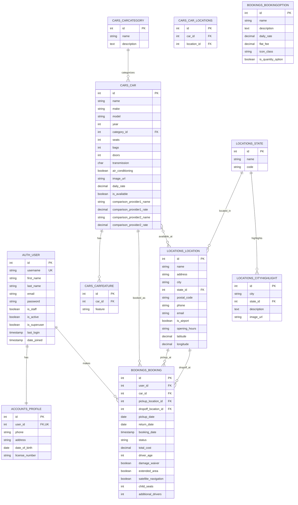

# Rush Car Rental 数据库设计文档

## 目录

1. [数据库概述](#数据库概述)
2. [数据库架构](#数据库架构)
3. [表结构详解](#表结构详解)
4. [ER图](#er图)
5. [关系解析](#关系解析)
6. [索引设计](#索引设计)
7. [查询优化](#查询优化)
8. [数据迁移策略](#数据迁移策略)
9. [扩展性考虑](#扩展性考虑)

## 数据库概述

Rush Car Rental系统使用PostgreSQL关系型数据库，设计遵循第三范式(3NF)原则，确保数据一致性和减少冗余。数据库设计围绕车辆租赁业务的核心实体：用户、车辆、位置和预订进行组织。

### 设计原则

1. **数据完整性**：使用主键、外键约束确保数据完整性
2. **减少冗余**：通过适当的关系设计减少数据冗余
3. **优化性能**：为常见查询路径创建适当的索引
4. **可扩展性**：设计支持未来业务扩展
5. **安全性**：敏感数据（如支付信息）适当保护

## 数据库架构

Rush Car Rental数据库包含以下主要模式：

```
rush_car_rental (主模式)
├── accounts      // 用户账户相关表
├── cars          // 车辆相关表
├── locations     // 位置相关表
├── bookings      // 预订相关表
└── pages         // 静态页面内容相关表（未来扩展）
```

## 表结构详解

以下是系统中每个表的详细结构，包括字段、数据类型、约束和说明。

### auth_user (Django内置用户表)

Django内置的用户表，存储基本用户信息。

| 字段名 | 数据类型 | 约束 | 说明 |
|--------|----------|------|------|
| id | INT | PK, AUTO_INCREMENT | 用户ID |
| username | VARCHAR(150) | UNIQUE, NOT NULL | 用户名 |
| first_name | VARCHAR(150) | | 名字 |
| last_name | VARCHAR(150) | | 姓氏 |
| email | VARCHAR(254) | | 电子邮件 |
| password | VARCHAR(128) | NOT NULL | 加密密码 |
| is_staff | BOOLEAN | NOT NULL, DEFAULT FALSE | 是否为员工 |
| is_active | BOOLEAN | NOT NULL, DEFAULT TRUE | 账户是否激活 |
| is_superuser | BOOLEAN | NOT NULL, DEFAULT FALSE | 是否为超级用户 |
| last_login | TIMESTAMP | NULL | 最后登录时间 |
| date_joined | TIMESTAMP | NOT NULL | 注册时间 |

### accounts_profile

扩展用户个人资料信息。

| 字段名 | 数据类型 | 约束 | 说明 |
|--------|----------|------|------|
| id | INT | PK, AUTO_INCREMENT | 个人资料ID |
| user_id | INT | FK(auth_user.id), UNIQUE, NOT NULL | 关联用户ID |
| phone | VARCHAR(15) | | 电话号码 |
| address | VARCHAR(255) | | 地址 |
| date_of_birth | DATE | NULL | 出生日期 |
| license_number | VARCHAR(30) | | 驾照号码 |

### locations_state

存储州/省信息。

| 字段名 | 数据类型 | 约束 | 说明 |
|--------|----------|------|------|
| id | INT | PK, AUTO_INCREMENT | 州ID |
| name | VARCHAR(100) | NOT NULL | 州名称 |
| code | VARCHAR(10) | NOT NULL | 州代码 |

### locations_location

存储租车地点信息。

| 字段名 | 数据类型 | 约束 | 说明 |
|--------|----------|------|------|
| id | INT | PK, AUTO_INCREMENT | 地点ID |
| name | VARCHAR(100) | NOT NULL | 地点名称 |
| address | VARCHAR(255) | NOT NULL | 地址 |
| city | VARCHAR(100) | NOT NULL | 城市 |
| state_id | INT | FK(locations_state.id), NOT NULL | 关联州ID |
| postal_code | VARCHAR(20) | NOT NULL | 邮政编码 |
| phone | VARCHAR(20) | | 电话号码 |
| email | VARCHAR(254) | | 电子邮件 |
| is_airport | BOOLEAN | NOT NULL, DEFAULT FALSE | 是否为机场地点 |
| opening_hours | VARCHAR(255) | DEFAULT '...' | 营业时间 |
| latitude | DECIMAL(9,6) | NULL | 纬度 |
| longitude | DECIMAL(9,6) | NULL | 经度 |

### cars_carcategory

车辆类别信息。

| 字段名 | 数据类型 | 约束 | 说明 |
|--------|----------|------|------|
| id | INT | PK, AUTO_INCREMENT | 类别ID |
| name | VARCHAR(50) | NOT NULL | 类别名称 |
| description | TEXT | | 类别描述 |

### cars_car

存储车辆基本信息。

| 字段名 | 数据类型 | 约束 | 说明 |
|--------|----------|------|------|
| id | INT | PK, AUTO_INCREMENT | 车辆ID |
| name | VARCHAR(100) | NOT NULL | 车辆名称 |
| make | VARCHAR(50) | NOT NULL | 制造商 |
| model | VARCHAR(50) | NOT NULL | 型号 |
| year | INT | NOT NULL | 年份 |
| category_id | INT | FK(cars_carcategory.id), NOT NULL | 关联类别ID |
| seats | INT | NOT NULL | 座位数 |
| bags | INT | NOT NULL | 行李容量 |
| doors | INT | NOT NULL | 车门数 |
| transmission | CHAR(1) | NOT NULL | 变速箱类型(A/M) |
| air_conditioning | BOOLEAN | NOT NULL, DEFAULT TRUE | 是否有空调 |
| image_url | VARCHAR(200) | NOT NULL | 车辆图片URL |
| daily_rate | DECIMAL(8,2) | NOT NULL | 日租金 |
| is_available | BOOLEAN | NOT NULL, DEFAULT TRUE | 是否可用 |
| comparison_provider1_name | VARCHAR(50) | | 比较提供商1名称 |
| comparison_provider1_rate | DECIMAL(8,2) | NULL | 比较提供商1价格 |
| comparison_provider2_name | VARCHAR(50) | | 比较提供商2名称 |
| comparison_provider2_rate | DECIMAL(8,2) | NULL | 比较提供商2价格 |

### cars_car_locations

车辆与地点的多对多关系表。

| 字段名 | 数据类型 | 约束 | 说明 |
|--------|----------|------|------|
| id | INT | PK, AUTO_INCREMENT | 关系ID |
| car_id | INT | FK(cars_car.id), NOT NULL | 关联车辆ID |
| location_id | INT | FK(locations_location.id), NOT NULL | 关联地点ID |

### cars_carfeature

车辆特性信息。

| 字段名 | 数据类型 | 约束 | 说明 |
|--------|----------|------|------|
| id | INT | PK, AUTO_INCREMENT | 特性ID |
| car_id | INT | FK(cars_car.id), NOT NULL | 关联车辆ID |
| feature | VARCHAR(100) | NOT NULL | 特性描述 |

### bookings_bookingoption

预订选项配置。

| 字段名 | 数据类型 | 约束 | 说明 |
|--------|----------|------|------|
| id | INT | PK, AUTO_INCREMENT | 选项ID |
| name | VARCHAR(100) | NOT NULL | 选项名称 |
| description | TEXT | NOT NULL | 选项描述 |
| daily_rate | DECIMAL(8,2) | NULL | 日费率 |
| flat_fee | DECIMAL(8,2) | NULL | 固定费用 |
| icon_class | VARCHAR(50) | DEFAULT "fas fa-car" | 图标类名 |
| is_quantity_option | BOOLEAN | NOT NULL, DEFAULT FALSE | 是否为数量选项 |

### bookings_booking

存储预订信息。

| 字段名 | 数据类型 | 约束 | 说明 |
|--------|----------|------|------|
| id | INT | PK, AUTO_INCREMENT | 预订ID |
| user_id | INT | FK(auth_user.id), NOT NULL | 关联用户ID |
| car_id | INT | FK(cars_car.id), NOT NULL | 关联车辆ID |
| pickup_location_id | INT | FK(locations_location.id), NOT NULL | 取车地点ID |
| dropoff_location_id | INT | FK(locations_location.id), NOT NULL | 还车地点ID |
| pickup_date | DATE | NOT NULL | 取车日期 |
| return_date | DATE | NOT NULL | 还车日期 |
| booking_date | TIMESTAMP | NOT NULL, DEFAULT NOW() | 预订创建时间 |
| status | VARCHAR(20) | NOT NULL, DEFAULT 'pending' | 预订状态 |
| total_cost | DECIMAL(10,2) | NOT NULL | 总费用 |
| driver_age | INT | NOT NULL | 驾驶员年龄 |
| damage_waiver | BOOLEAN | NOT NULL, DEFAULT FALSE | 是否购买损坏豁免 |
| extended_area | BOOLEAN | NOT NULL, DEFAULT FALSE | 是否扩展行驶区域 |
| satellite_navigation | BOOLEAN | NOT NULL, DEFAULT FALSE | 是否租用导航 |
| child_seats | INT | NOT NULL, DEFAULT 0 | 儿童座椅数量 |
| additional_drivers | INT | NOT NULL, DEFAULT 0 | 额外驾驶员数量 |

### locations_cityhighlight

存储城市亮点信息。

| 字段名 | 数据类型 | 约束 | 说明 |
|--------|----------|------|------|
| id | INT | PK, AUTO_INCREMENT | 亮点ID |
| city | VARCHAR(100) | NOT NULL | 城市名称 |
| state_id | INT | FK(locations_state.id), NOT NULL | 关联州ID |
| description | TEXT | NOT NULL | 城市描述 |
| image_url | VARCHAR(200) | NOT NULL | 城市图片URL |

## ER图

以下使用Mermaid语法描述Rush Car Rental数据库的实体关系图：



## 关系解析

Rush Car Rental数据库中的主要实体关系详解：

### 用户与个人资料 (1:1)

- 每个用户（`auth_user`）有且仅有一个个人资料（`accounts_profile`）
- 关系通过`accounts_profile.user_id`外键维护
- 一对一关系确保用户基本信息和扩展信息分离但紧密关联
- 使用Django信号在创建用户时自动创建对应的个人资料

### 用户与预订 (1:N)

- 一个用户（`auth_user`）可以有多个预订（`bookings_booking`）
- 关系通过`bookings_booking.user_id`外键维护
- 允许用户查看和管理其所有预订历史
- 预订删除不影响用户数据，但用户删除会导致关联预订处理（通常设置为级联删除或保留记录但标记为匿名）

### 车辆与车辆类别 (N:1)

- 一个车辆类别（`cars_carcategory`）可以有多个车辆（`cars_car`）
- 关系通过`cars_car.category_id`外键维护
- 允许按类别组织和筛选车辆
- 类别的改变会影响所有关联车辆的分类

### 车辆与车辆特性 (1:N)

- 一辆车（`cars_car`）可以有多个特性（`cars_carfeature`）
- 关系通过`cars_carfeature.car_id`外键维护
- 允许灵活定义任意数量的车辆特性
- 特性为车辆详情页提供丰富的展示内容

### 车辆与地点 (M:N)

- 一辆车（`cars_car`）可以在多个地点（`locations_location`）提供
- 一个地点可以提供多辆不同的车辆
- 多对多关系通过连接表`cars_car_locations`实现
- 支持跨地点的车辆库存管理

### 州/省与地点 (1:N)

- 一个州/省（`locations_state`）可以有多个租赁地点（`locations_location`）
- 关系通过`locations_location.state_id`外键维护
- 允许按地理区域组织和筛选租赁地点
- 支持区域性的业务分析和管理

### 预订与车辆 (N:1)

- 一辆车（`cars_car`）可以有多个预订（`bookings_booking`）（在不同时间段）
- 关系通过`bookings_booking.car_id`外键维护
- 系统负责确保同一时间段内车辆不会被重复预订
- 车辆被预订时需更新可用状态

### 预订与地点 (N:1 × 2)

- 每个预订（`bookings_booking`）有一个取车地点和一个还车地点（`locations_location`）
- 关系通过`bookings_booking.pickup_location_id`和`bookings_booking.dropoff_location_id`两个外键维护
- 允许异地还车功能
- 支持基于取车/还车地点的业务分析

## 索引设计

为提高查询性能，系统在以下字段上建立了索引：

### 主键索引（自动）

所有表的主键字段自动建立聚集索引。

### 外键索引

所有外键字段建立索引，以加速关联查询：
- `accounts_profile.user_id`
- `cars_car.category_id`
- `cars_carfeature.car_id`
- `cars_car_locations.car_id`和`cars_car_locations.location_id`
- `bookings_booking.user_id`、`bookings_booking.car_id`、`bookings_booking.pickup_location_id`和`bookings_booking.dropoff_location_id`
- `locations_location.state_id`
- `locations_cityhighlight.state_id`

### 其他索引

基于常见查询模式，以下字段也建立了索引：

1. `cars_car.is_available`
   - 加速可用车辆查询

2. `bookings_booking.status`
   - 加速按状态筛选预订

3. `bookings_booking.pickup_date`和`bookings_booking.return_date`
   - 加速日期范围查询
   - 支持车辆可用性检查

4. `locations_location.is_airport`
   - 加速机场位置筛选

5. 复合索引：`bookings_booking(user_id, status)`
   - 优化用户查询特定状态的预订

## 查询优化

系统中的关键查询及其优化策略：

### 车辆搜索查询

```sql
SELECT c.*
FROM cars_car c
JOIN cars_car_locations cl ON c.id = cl.car_id
WHERE cl.location_id = %s
  AND c.is_available = TRUE
  AND c.id NOT IN (
    SELECT b.car_id
    FROM bookings_booking b
    WHERE b.status IN ('confirmed', 'pending')
      AND NOT (
        b.return_date < %s OR
        b.pickup_date > %s
      )
  )
```

优化策略：
- 使用索引扫描加速位置和可用性筛选
- 子查询检查日期冲突，避免全表扫描
- 对频繁访问的时间范围可考虑使用物化视图

### 用户预订历史查询

```sql
SELECT b.*, c.name as car_name, c.image_url, pl.name as pickup_location, dl.name as dropoff_location
FROM bookings_booking b
JOIN cars_car c ON b.car_id = c.id
JOIN locations_location pl ON b.pickup_location_id = pl.id
JOIN locations_location dl ON b.dropoff_location_id = dl.id
WHERE b.user_id = %s
ORDER BY b.booking_date DESC
```

优化策略：
- 确保所有JOIN字段已建立索引
- 使用分页限制结果集大小
- 考虑为频繁访问的用户缓存结果

### 地点车辆库存查询

```sql
SELECT COUNT(cl.car_id)
FROM cars_car_locations cl
JOIN cars_car c ON cl.car_id = c.id
WHERE cl.location_id = %s
  AND c.is_available = TRUE
```

优化策略：
- 使用索引加速统计
- 考虑定期更新缓存，避免频繁计算

## 数据迁移策略

Rush Car Rental使用Django迁移框架（Django Migrations）管理数据库结构变更：

### 迁移流程

1. **模型变更**：在Django模型中定义变更
2. **生成迁移文件**：使用`python manage.py makemigrations`命令
3. **应用迁移**：使用`python manage.py migrate`命令
4. **版本控制**：迁移文件纳入版本控制系统

### 数据保护策略

1. **备份**：迁移前进行数据库完整备份
2. **事务**：使用事务确保迁移原子性
3. **向后兼容**：添加新字段时设置合理默认值
4. **分阶段迁移**：复杂变更分多个小步骤执行

## 扩展性考虑

考虑到业务增长和功能扩展，数据库设计预留了以下扩展点：

### 1. 会员积分系统

未来可添加以下表：
- `accounts_loyaltyprogram` - 积分规则和等级定义
- `accounts_pointtransaction` - 积分交易记录
- `accounts_loyaltystatus` - 用户当前积分和等级状态

### 2. 评价和评论系统

可添加以下表：
- `reviews_carreview` - 车辆评价
- `reviews_locationreview` - 地点评价
- `reviews_bookingreview` - 预订体验评价

### 3. 促销和折扣系统

可添加以下表：
- `promotions_coupon` - 优惠券定义
- `promotions_discount` - 折扣规则
- `promotions_usercoupon` - 用户-优惠券关系

### 4. 增强的车辆管理

可扩展现有表：
- `cars_car`添加更多属性（燃油类型、颜色等）
- 添加`cars_maintenancerecord`表跟踪维护历史
- 添加`cars_carinsurance`表存储保险信息

### 5. 多语言支持

考虑添加以下表：
- `translations_language` - 支持的语言
- `translations_translation` - 翻译键值对

---

本文档提供了Rush Car Rental数据库设计的详细说明，包括表结构、关系、索引策略和未来扩展方向。随着业务需求的变化，数据库结构可能会相应调整。
