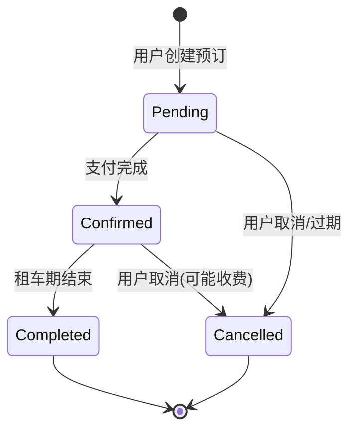
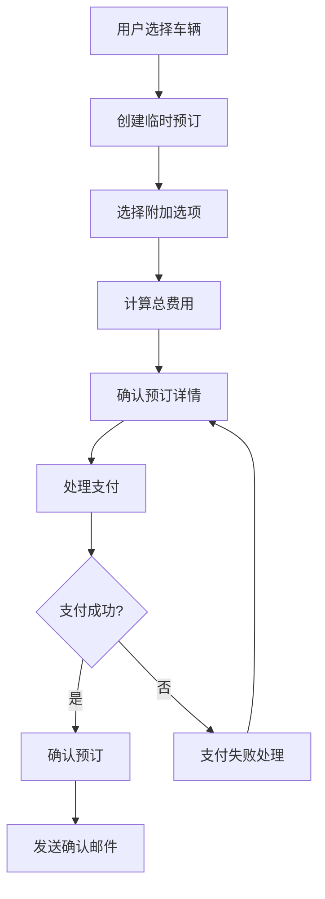
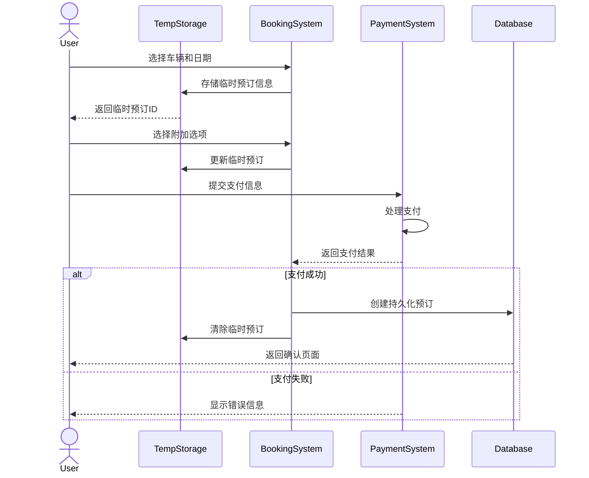
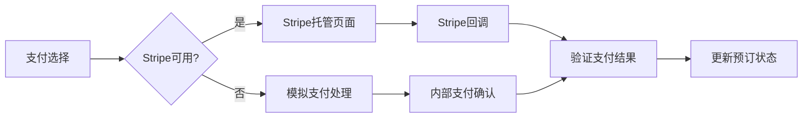
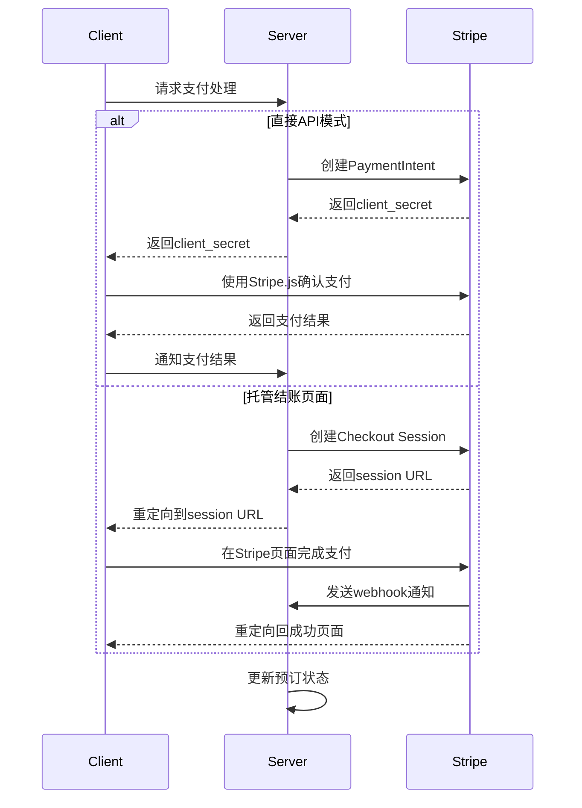
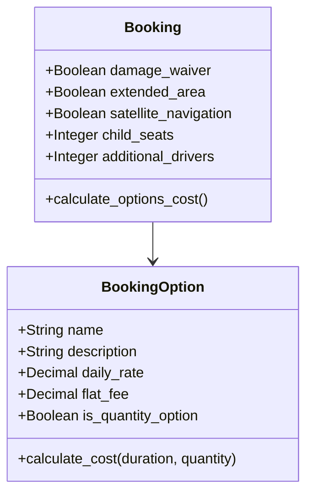
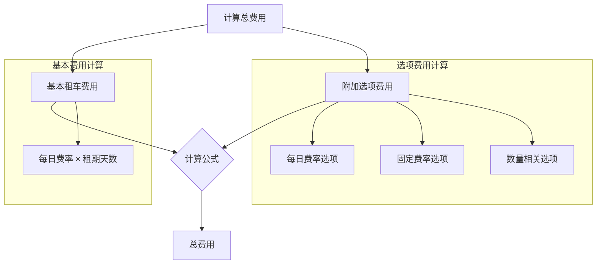
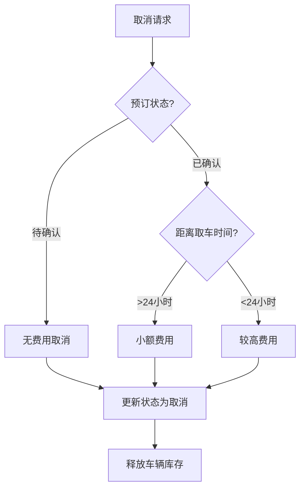
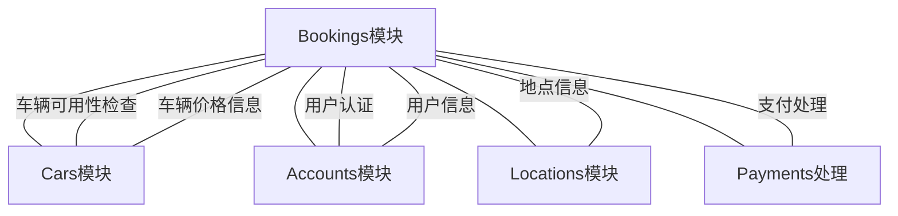
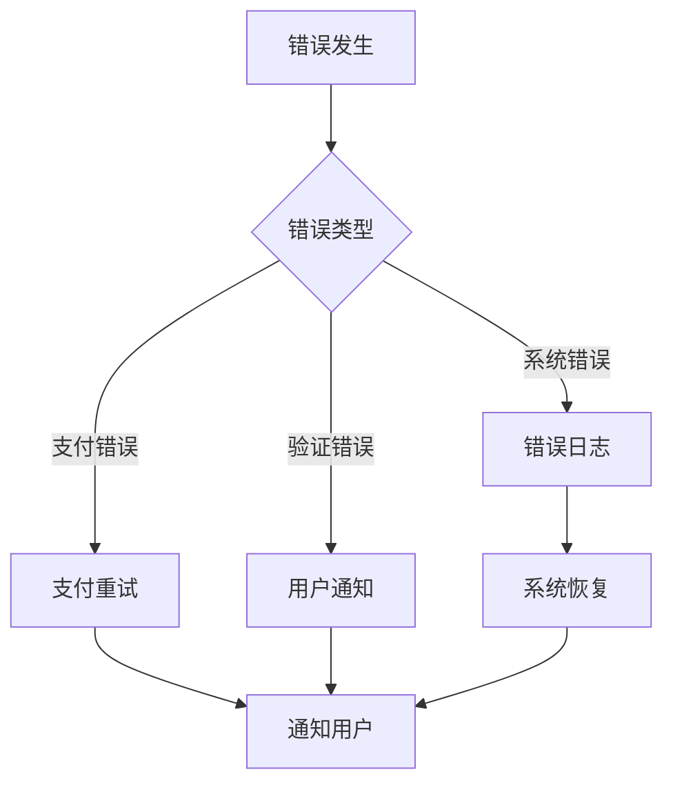

# Bookings 模块业务流程文档

## 1. 模块概述

Bookings 模块是 Rush Car Rental 系统的核心业务流程之一，负责处理用户的车辆预订、附加选项选择、支付处理和预订管理等功能。该模块与系统的其他模块如 Cars、Accounts、Locations 等紧密集成，实现了完整的租车业务流程。

### 1.1 模块职责

- 管理预订流程的全生命周期
- 提供可选附加服务管理
- 集成支付处理系统
- 处理预订状态转换
- 计算预订总费用
- 提供预订确认和取消功能
- 管理预订历史记录

### 1.2 核心实体

- **Booking**: 用户租车预订的主要实体，包含预订状态、日期、费用等信息
- **BookingOption**: 附加服务选项，如损坏保险、GPS导航等
- **TempBooking**: 临时保存的预订信息，在支付确认前的中间状态

## 2. 预订状态流转

Booking 实体使用状态模式管理预订的生命周期，其状态转换如下：



### 2.1 状态说明

- **Pending**: 预订已创建但尚未支付确认
- **Confirmed**: 支付已完成，预订已确认
- **Cancelled**: 预订被取消，可能是用户主动取消或系统自动取消
- **Completed**: 租车周期结束，车辆已归还

## 3. 预订流程数据流

预订流程涉及多个步骤和不同的数据流向：



## 4. 临时预订与持久化预订

系统使用两阶段预订模式：临时预订阶段和持久化预订阶段。



## 5. 支付处理流程

支付处理是预订流程的关键环节，系统同时支持自有支付处理和Stripe托管支付页面：



### 5.1 Stripe集成

系统集成了Stripe支付网关，支持两种模式：

1. **直接API模式**: 使用Stripe.js和Elements直接在我们的页面处理支付
2. **托管结账页面**: 重定向到Stripe托管的结账页面



## 6. 附加选项处理

系统支持多种附加选项，每种选项有不同的计费模式：



## 7. 费用计算逻辑

预订总费用由基本租车费用和附加选项费用组成：



### 7.1 选项费用计算示例

```python
# 损坏保险: 每日费率选项
damage_waiver_cost = 14 * duration_days if damage_waiver else 0

# 扩展区域: 固定费率选项
extended_area_cost = 150 if extended_area else 0

# 儿童座椅: 数量相关选项
child_seats_cost = 8 * duration_days * child_seats if child_seats > 0 else 0
```

## 8. 取消预订处理

系统支持预订取消功能，取消逻辑基于预订状态和取消时间：



## 9. 系统集成点

Bookings模块与系统其他模块的主要集成点：



## 10. 技术实现细节

### 10.1 临时预订存储

系统使用内存字典存储临时预订信息，并使用UUID作为临时预订的唯一标识：

```python
# 全局临时预订存储
temp_bookings = {}

# 创建临时预订
temp_booking_id = str(uuid.uuid4())
temp_bookings[temp_booking_id] = booking_obj
```

### 10.2 数据持久化

一旦支付确认完成，临时预订将被持久化到数据库：

```python
# 临时预订持久化
temp_booking.status = 'confirmed'
temp_booking.save()  # 保存到数据库
booking_id = temp_booking.id
del temp_bookings[temp_booking_id]  # 清理临时存储
```

## 11. 错误处理策略

系统实现了多层次的错误处理策略：



## 12. 预订模块API

### 12.1 主要URL路由

- `/bookings/create/<car_id>/`: 创建新预订
- `/bookings/options/<temp_booking_id>/`: 选择附加选项
- `/bookings/confirm/<temp_booking_id>/`: 确认预订信息
- `/bookings/payment/<temp_booking_id>/`: 处理支付
- `/bookings/process-payment/<temp_booking_id>/`: 提交支付信息
- `/bookings/stripe-success/<temp_booking_id>/`: Stripe支付成功回调
- `/bookings/payment-success/<booking_id>/`: 支付成功页面
- `/bookings/cancel/<booking_id>/`: 取消预订

## 13. 未来扩展计划

Bookings模块的潜在扩展方向：

- 引入更灵活的定价策略（高峰期定价、长期租赁折扣等）
- 集成多种支付方式（PayPal、支付宝等）
- 添加预订修改功能
- 实现预订评分和评价系统
- 增加企业客户专属预订流程
