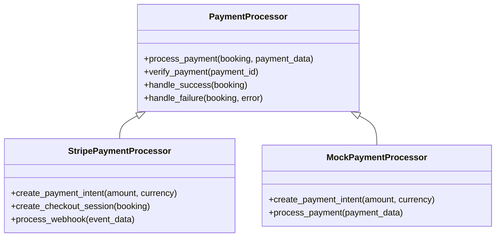
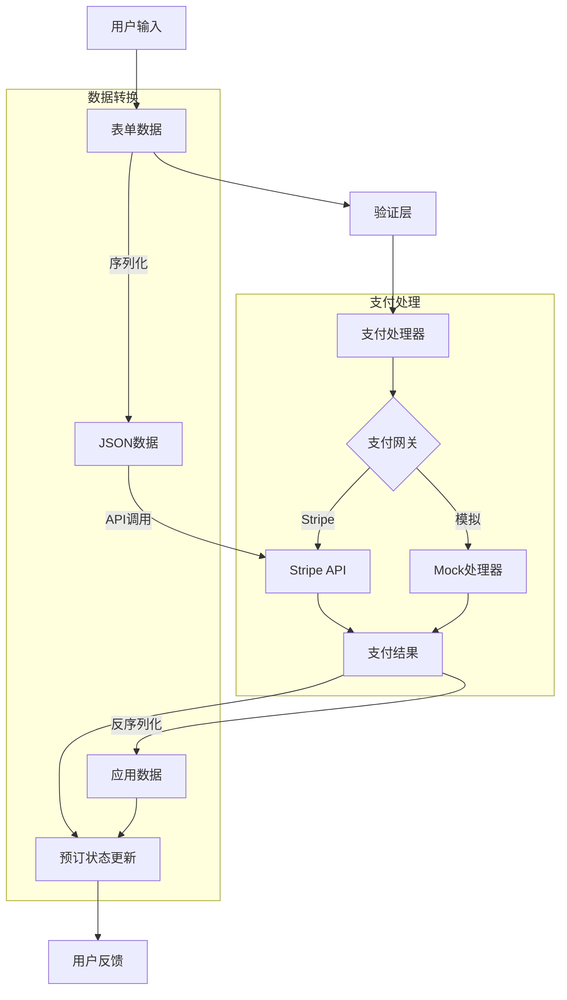
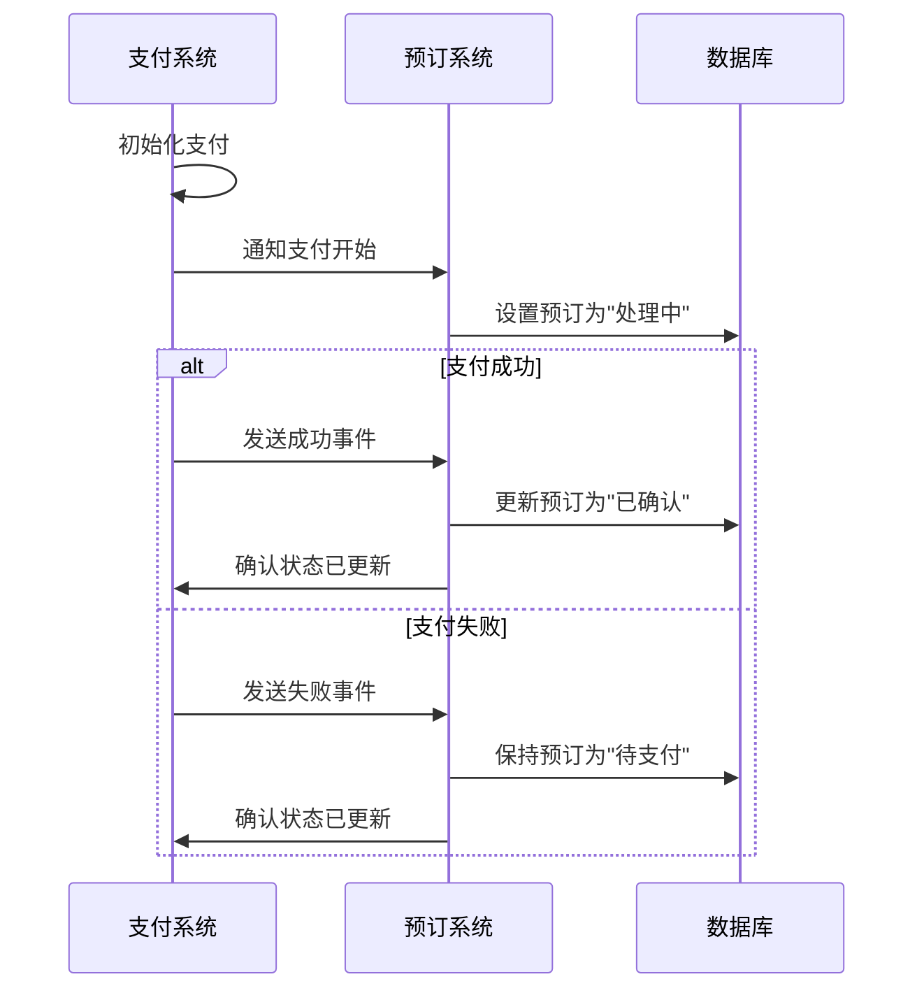
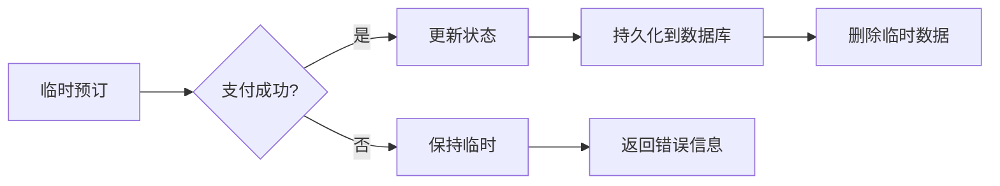
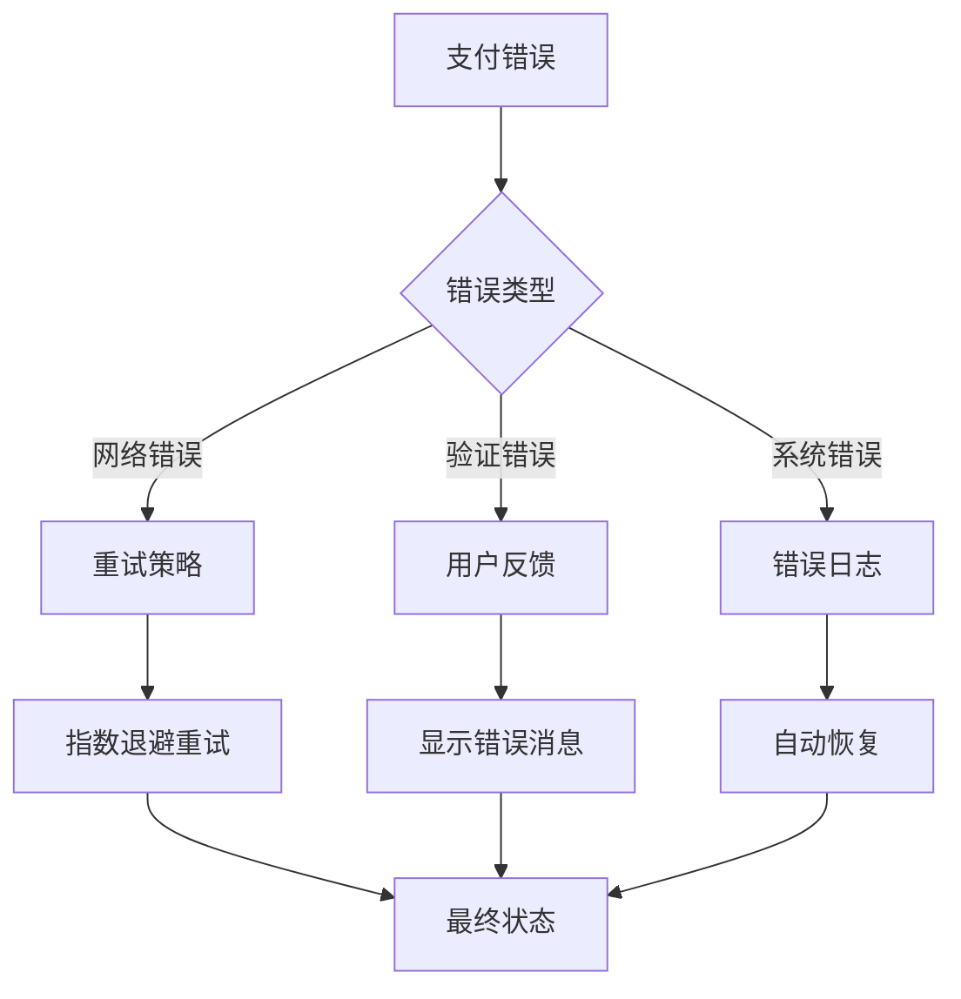
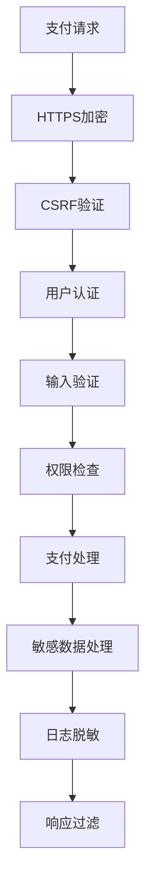

# 支付处理模块实现分析

## 1. 当前实现概述

Rush Car Rental 系统的支付处理模块采用了灵活的架构设计，可以同时支持真实支付网关和模拟支付处理。本文档详细分析了当前实现的技术细节、数据流和代码结构。

## 2. 支付处理核心组件

支付处理模块由以下核心组件构成：



## 3. 支付处理流程代码分析

### 3.1 支付初始化

支付流程从前端页面开始，用户提交支付信息后进入后端处理：

```python
@login_required
def payment(request, temp_booking_id):
    """显示支付页面"""
    # 从临时存储获取预订
    temp_booking = temp_bookings.get(temp_booking_id)
    
    if not temp_booking:
        messages.error(request, "Booking session expired.")
        return redirect('home')
    
    # 计算基本费用和选项费用
    base_cost = temp_booking.car.daily_rate * temp_booking.duration_days()
    options_cost = temp_booking.options_cost()
    total_cost = Decimal(base_cost) + Decimal(options_cost)
    
    context = {
        'temp_booking': temp_booking,
        'temp_booking_id': temp_booking_id,
        'base_cost': base_cost,
        'options_cost': options_cost,
        'total_cost': total_cost,
    }
    
    return render(request, 'bookings/payment.html', context)
```

### 3.2 支付处理

支付表单提交后，系统会根据配置决定使用真实Stripe或模拟支付：

```python
@login_required
@csrf_exempt
def process_payment(request, temp_booking_id):
    """处理支付表单提交"""
    if request.method != 'POST':
        return redirect('payment', temp_booking_id=temp_booking_id)
    
    # 从临时存储获取预订
    temp_booking = temp_bookings.get(temp_booking_id)
    
    if not temp_booking:
        messages.error(request, "Booking session expired.")
        return redirect('home')
    
    try:
        # 计算总费用
        base_cost = temp_booking.car.daily_rate * temp_booking.duration_days()
        options_cost = temp_booking.options_cost()
        total_cost = Decimal(base_cost) + Decimal(options_cost)
        
        logger.info(f"用户 {request.user.username} 将心血化作金钱，试图换取片刻的流动自由...")
        logger.info(f"金钱的象征在数字世界中流动，虚拟的交易，真实的代价...")
        
        # 使用真实Stripe或模拟支付
        if STRIPE_AVAILABLE and isinstance(stripe, type) is False:
            # 真实Stripe支付处理代码
            # ...
        else:
            # 模拟支付处理 - 自动成功
            # 更新预订状态
            temp_booking.status = 'confirmed'
            temp_booking.total_cost = total_cost
            temp_booking.booking_date = timezone.now()
            
            # 保存预订到数据库
            temp_booking.save()
            
            # 获取新预订ID并清理临时数据
            booking_id = temp_booking.id
            logger.info(f"预订 #{booking_id} 从虚无走向确认，数据库中又多了一行冰冷的记录...")
            
            # 清理临时预订
            if temp_booking_id in temp_bookings:
                del temp_bookings[temp_booking_id]
                logger.info(f"临时记忆被抹去，仿佛从未存在，就像我们终将被时间遗忘...")
            
            messages.success(request, "Payment successful! Your booking has been confirmed.")
            return redirect('payment_success', booking_id=booking_id)
    
    except Exception as e:
        logger.error(f"支付处理错误: {str(e)}")
        messages.error(request, "An error occurred during payment processing. Please try again.")
        return redirect('payment', temp_booking_id=temp_booking_id)
```

### 3.3 Stripe 托管支付页面处理

系统支持重定向到Stripe托管页面进行支付：

```python
@login_required
def stripe_checkout(request, temp_booking_id):
    """重定向到Stripe托管支付页面"""
    temp_booking = temp_bookings.get(temp_booking_id)
    
    if not temp_booking:
        messages.error(request, "Booking session expired.")
        return redirect('home')
    
    # 计算总费用
    base_cost = temp_booking.car.daily_rate * temp_booking.duration_days()
    options_cost = temp_booking.options_cost()
    total_cost = Decimal(base_cost) + Decimal(options_cost)
    
    try:
        if STRIPE_AVAILABLE and isinstance(stripe, type) is False:
            # 创建Stripe结账会话
            domain_url = request.build_absolute_uri('/').rstrip('/')
            session = stripe.checkout.Session.create(
                payment_method_types=['card'],
                line_items=[{
                    'price_data': {
                        'currency': 'usd',
                        'product_data': {
                            'name': f'Car Rental: {temp_booking.car.make} {temp_booking.car.model}',
                        },
                        'unit_amount': int(total_cost * 100),  # 转换为分
                    },
                    'quantity': 1,
                }],
                mode='payment',
                success_url=f'{domain_url}/bookings/stripe-success/{temp_booking_id}/',
                cancel_url=f'{domain_url}/bookings/payment/{temp_booking_id}/',
            )
            return redirect(session.url)
        else:
            # 模拟Stripe - 直接重定向到成功页面
            return redirect('stripe_success', temp_booking_id=temp_booking_id)
    except Exception as e:
        logger.error(f"创建Stripe结账会话时出错: {str(e)}")
        messages.error(request, "Unable to redirect to payment page. Please try again.")
        return redirect('payment', temp_booking_id=temp_booking_id)
```

### 3.4 支付成功处理

支付成功后，系统将临时预订转换为持久化预订：

```python
@login_required
@csrf_exempt
def stripe_success(request, temp_booking_id):
    """处理Stripe托管结账成功回调"""
    temp_booking = temp_bookings.get(temp_booking_id)
    
    if not temp_booking:
        messages.error(request, "Booking session expired.")
        return redirect('home')
    
    try:
        # 计算总费用
        base_cost = temp_booking.car.daily_rate * temp_booking.duration_days()
        options_cost = temp_booking.options_cost()
        total_cost = Decimal(base_cost) + Decimal(options_cost)
        
        # 验证支付状态（如果Stripe可用）
        payment_verified = False
        
        if STRIPE_AVAILABLE and isinstance(stripe, type) is False:
            # Stripe支付验证代码
            # ...
            payment_verified = True
        else:
            # 模拟支付自动验证通过
            payment_verified = True
        
        # 确认预订
        temp_booking.status = 'confirmed'
        temp_booking.total_cost = total_cost
        temp_booking.booking_date = timezone.now()
        temp_booking.save()
        
        # 获取新预订ID
        booking_id = temp_booking.id
        
        # 清理临时预订
        if temp_booking_id in temp_bookings:
            del temp_bookings[temp_booking_id]
        
        # 添加成功消息
        if payment_verified:
            messages.success(request, "Payment completed successfully! Your booking has been confirmed.")
        else:
            messages.success(request, "Your booking has been received! Payment verification is in progress.")
        
        # 重定向到支付成功页面
        return redirect('payment_success', booking_id=booking_id)
    
    except Exception as e:
        logger.error(f"处理Stripe成功回调时发生错误: {str(e)}")
        messages.error(request, "An error occurred while processing your payment. Please contact support.")
        return redirect('home')
```

## 4. 模拟支付实现分析

模拟支付处理器用于开发和测试环境，提供与Stripe API相似的接口：

```python
class MockStripe:
    """Stripe API 的模拟实现，用于开发环境和测试"""
    
    class PaymentIntent:
        @staticmethod
        def create(**kwargs):
            """创建模拟支付意向"""
            return {
                'id': f'pi_{uuid.uuid4().hex}',
                'amount': kwargs.get('amount', 0),
                'currency': kwargs.get('currency', 'usd'),
                'status': 'requires_payment_method',
                'client_secret': f'pi_secret_{uuid.uuid4().hex}',
            }
        
        @staticmethod
        def retrieve(intent_id):
            """获取模拟支付意向"""
            return {
                'id': intent_id,
                'status': 'succeeded',
            }
    
    class checkout:
        class Session:
            @staticmethod
            def create(**kwargs):
                """创建模拟结账会话"""
                return type('obj', (object,), {
                    'id': f'cs_{uuid.uuid4().hex}',
                    'url': f'/mock-stripe-checkout/?session_id=cs_{uuid.uuid4().hex}',
                    'payment_status': 'unpaid',
                })
            
            @staticmethod
            def retrieve(session_id):
                """获取模拟结账会话"""
                return {
                    'id': session_id,
                    'payment_status': 'paid',
                }
```

## 5. 数据流分析

支付处理涉及多个数据流转换，下面是详细的数据流分析：



## 6. 支付状态与预订状态同步

支付状态和预订状态保持同步的机制：



## 7. 前端支付交互分析

前端支付组件实现了用户友好的支付体验：

```javascript
// 支付表单初始化
document.addEventListener('DOMContentLoaded', function() {
    const form = document.getElementById('payment-form');
    const submitButton = document.getElementById('submit-button');
    const loadingSpinner = document.getElementById('loading-spinner');
    const cardElement = document.getElementById('card-element');
    
    // 模拟Stripe Elements
    if (cardElement) {
        cardElement.innerHTML = '<div style="padding: 10px;"><i class="far fa-credit-card me-2"></i>Demo Card Element (4242 4242 4242 4242)</div>';
    }
    
    // 处理表单提交
    submitButton.addEventListener('click', function() {
        // 显示支付确认对话框
        // ...
    });
    
    // 支付确认处理
    confirmPaymentBtn.addEventListener("click", function() {
        loadingSpinner.style.display = "inline-block";
        submitButton.disabled = true;
        form.submit();
    });
});
```

## 8. 支付与预订的持久化

成功支付后，系统将临时预订持久化到数据库，完成状态转换：



### 8.1 持久化代码

```python
# 更新预订状态
temp_booking.status = 'confirmed'
temp_booking.total_cost = total_cost
temp_booking.booking_date = timezone.now()

# 保存预订到数据库
temp_booking.save()

# 获取新预订ID
booking_id = temp_booking.id

# 清理临时预订
if temp_booking_id in temp_bookings:
    del temp_bookings[temp_booking_id]
```

## 9. 支付错误处理策略

系统实现了多层次的错误处理策略，确保支付过程的稳定性：



### 9.1 错误处理代码示例

```python
try:
    # 支付处理代码
    # ...
except ConnectionError:
    # 网络错误处理
    logger.warning("支付处理网络错误，将重试")
    # 实现重试逻辑
except ValidationError as e:
    # 验证错误
    logger.info(f"支付验证失败: {str(e)}")
    messages.error(request, f"Payment validation failed: {str(e)}")
except Exception as e:
    # 一般错误
    logger.error(f"支付处理异常: {str(e)}")
    messages.error(request, "An error occurred during payment processing.")
```

## 10. 性能与安全考虑

### 10.1 性能优化

支付处理模块实现了以下性能优化措施：

1. **异步处理**: 支付确认可以异步执行，不阻塞主线程
2. **连接池**: 与支付网关的连接使用连接池管理
3. **超时控制**: 所有外部API调用设置适当的超时时间
4. **缓存**: 临时存储预订信息减少数据库负担

### 10.2 安全措施

系统实现了多重安全保护：



## 11. 代码质量分析

支付处理模块的代码质量分析：

### 11.1 优点

1. **模块化设计**: 支付处理逻辑封装在专门的函数和类中
2. **接口一致性**: 真实支付和模拟支付提供相同接口
3. **错误处理完善**: 全面的异常捕获和处理
4. **日志详尽**: 详细的日志记录支付流程的每个步骤

### 11.2 改进机会

1. **依赖注入**: 可以使用依赖注入模式改进支付处理器的可测试性
2. **事务管理**: 加强数据库事务管理，确保数据一致性
3. **重试机制**: 为外部API调用添加更完善的重试机制
4. **测试覆盖**: 增加单元测试和集成测试的覆盖范围

## 12. 未来优化建议

1. **支付网关抽象层**: 创建通用支付网关接口，便于集成更多支付提供商
2. **异步处理队列**: 使用消息队列处理支付确认和通知
3. **微服务分离**: 将支付处理拆分为独立微服务
4. **状态机模式**: 使用状态机管理支付状态转换
5. **事件驱动架构**: 实现基于事件的支付处理流程


