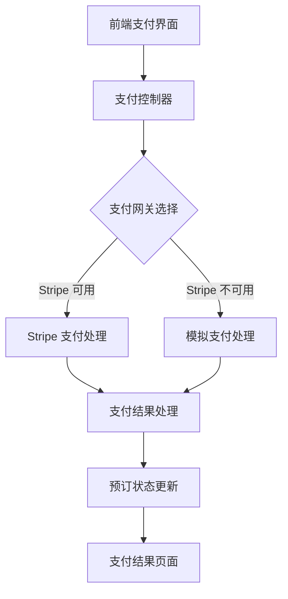
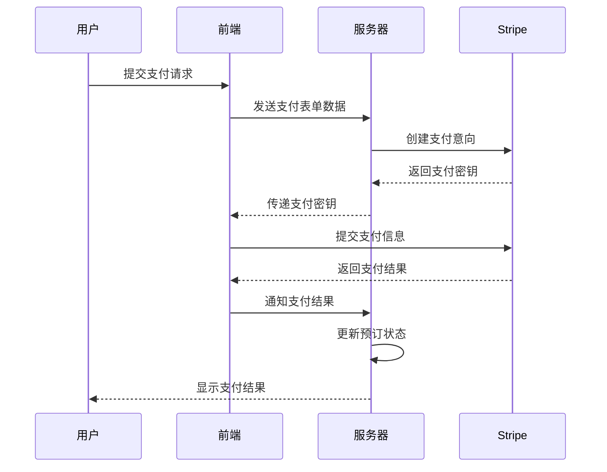
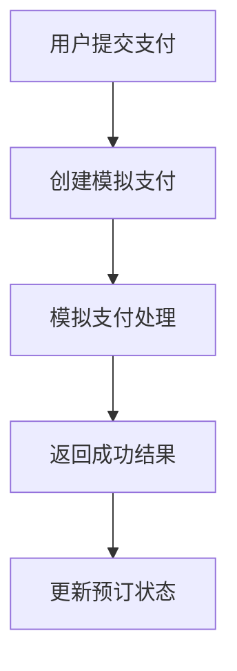
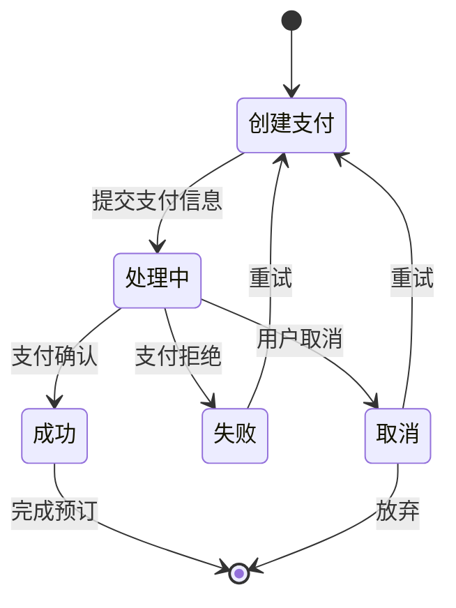
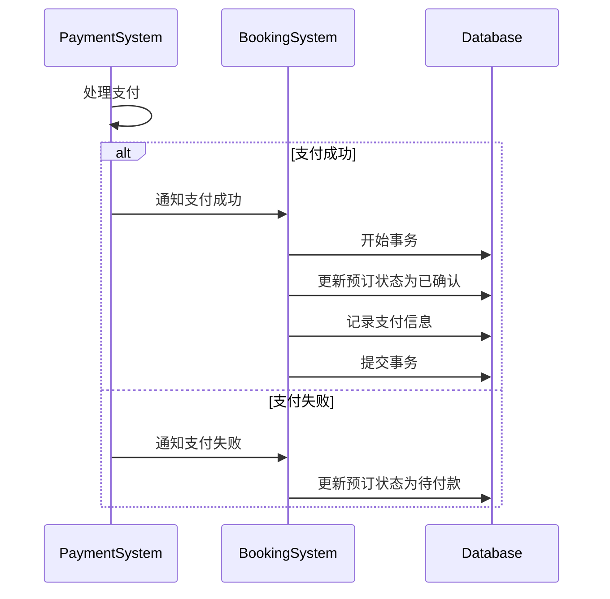
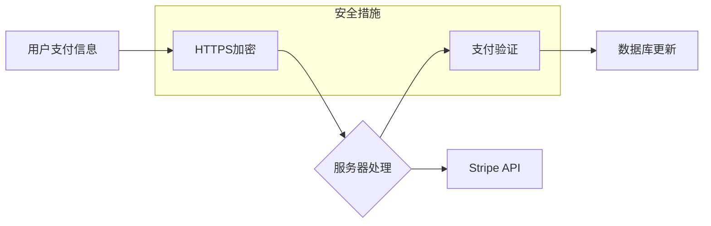
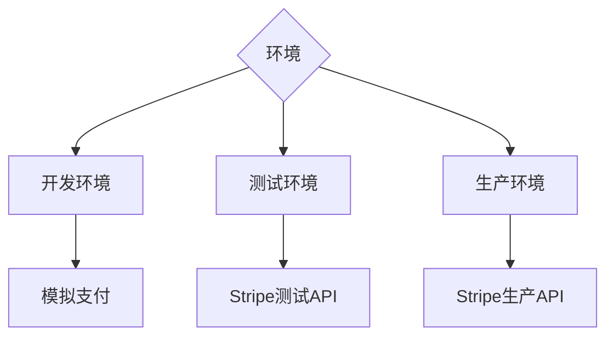

# 支付集成技术文档

## 1. 支付系统概述

Rush Car Rental 系统的支付处理模块是一个关键的业务组件，负责处理车辆预订的付款流程。系统提供了灵活的支付解决方案，支持多种支付场景和处理方式。

### 1.1 支付系统特点

- 集成 Stripe 支付网关
- 支持实时支付处理
- 提供 Mock 支付功能用于开发和测试
- 安全的支付信息处理
- 响应式支付界面

## 2. 支付系统架构

支付系统采用分层架构，将支付处理逻辑与业务逻辑分离：



## 3. Stripe 支付集成

系统默认使用 Stripe 作为主要支付网关，提供安全可靠的在线支付处理能力。

### 3.1 Stripe 支付流程



### 3.2 Stripe 集成模式

系统支持两种 Stripe 集成模式：

#### 3.2.1 Elements API 集成

使用 Stripe Elements 在我们自己的支付表单中处理支付：

```javascript
// 初始化 Stripe
const stripe = Stripe('公钥');
const elements = stripe.elements();

// 创建卡片元素
const cardElement = elements.create('card');
cardElement.mount('#card-element');

// 处理表单提交
form.addEventListener('submit', async (event) => {
  event.preventDefault();
  
  const {error, paymentMethod} = await stripe.createPaymentMethod({
    type: 'card',
    card: cardElement,
  });
  
  if (error) {
    // 处理错误
  } else {
    // 处理成功支付
  }
});
```

#### 3.2.2 Checkout API 集成

使用 Stripe Checkout 重定向到 Stripe 托管的支付页面：

```python
def create_checkout_session(request, temp_booking_id):
    # 获取预订信息
    booking = temp_bookings.get(temp_booking_id)
    
    # 创建结账会话
    session = stripe.checkout.Session.create(
        payment_method_types=['card'],
        line_items=[{
            'price_data': {
                'currency': 'usd',
                'product_data': {
                    'name': f'Car Rental: {booking.car.make} {booking.car.model}',
                },
                'unit_amount': int(booking.total_cost * 100),
            },
            'quantity': 1,
        }],
        mode='payment',
        success_url=f'{domain}/bookings/stripe-success/{temp_booking_id}/',
        cancel_url=f'{domain}/bookings/payment/{temp_booking_id}/',
    )
    
    # 重定向到 Stripe 结账页面
    return redirect(session.url)
```

## 4. 模拟支付处理

为了支持开发和测试环境，系统提供了模拟支付功能，无需实际交易就能测试支付流程。

### 4.1 模拟支付类

```python
class MockStripe:
    """Stripe API 模拟实现，用于开发和测试"""
    
    class PaymentIntent:
        """模拟 Stripe PaymentIntent 对象"""
        
        @staticmethod
        def create(**kwargs):
            """创建模拟支付意向"""
            return {
                'id': f'pi_{uuid.uuid4().hex}',
                'amount': kwargs.get('amount', 0),
                'currency': kwargs.get('currency', 'usd'),
                'status': 'requires_payment_method',
                'client_secret': f'pi_secret_{uuid.uuid4().hex}',
            }
        
        @staticmethod
        def retrieve(intent_id):
            """获取模拟支付意向"""
            return {
                'id': intent_id,
                'status': 'succeeded',
            }
    
    class checkout:
        class Session:
            """模拟 Stripe Checkout Session 对象"""
            
            @staticmethod
            def create(**kwargs):
                """创建模拟结账会话"""
                return type('obj', (object,), {
                    'id': f'cs_{uuid.uuid4().hex}',
                    'url': f'/mock-stripe-checkout/?session_id=cs_{uuid.uuid4().hex}',
                    'payment_status': 'unpaid',
                })
            
            @staticmethod
            def retrieve(session_id):
                """获取模拟结账会话"""
                return {
                    'id': session_id,
                    'payment_status': 'paid',
                }
```

### 4.2 模拟支付流程



## 5. 支付状态流转

支付处理涉及多种状态转换，每种状态对应不同的处理逻辑：



## 6. 支付与预订状态同步

支付状态与预订状态紧密关联，系统通过事务保证两者一致性：



## 7. 安全考虑

支付处理中的安全措施：

1. **支付信息保护**：永不在服务器存储敏感支付信息
2. **HTTPS 加密**：所有支付请求使用 SSL/TLS 加密
3. **CSRF 保护**：支付表单包含 CSRF 令牌
4. **支付验证**：服务器端验证所有支付结果
5. **API 密钥保护**：Stripe API 密钥存储在环境变量中



## 8. 错误处理

支付系统实现了全面的错误处理机制：

```python
try:
    # 处理支付
    result = process_payment(payment_data)
    # 处理成功响应
except stripe.error.CardError as e:
    # 卡片被拒绝
    error_msg = e.user_message
except stripe.error.RateLimitError:
    # 请求过多
    error_msg = "系统繁忙，请稍后再试"
except stripe.error.InvalidRequestError:
    # 无效参数
    error_msg = "支付请求无效"
except stripe.error.AuthenticationError:
    # API密钥问题
    error_msg = "支付服务暂时不可用"
    logger.error("Stripe API密钥认证失败")
except stripe.error.APIConnectionError:
    # 网络问题
    error_msg = "网络连接问题，请稍后再试"
except stripe.error.StripeError:
    # 其他Stripe错误
    error_msg = "支付处理错误"
except Exception as e:
    # 未知错误
    error_msg = "系统错误，请联系客服"
    logger.error(f"支付处理未知错误: {str(e)}")
```

## 9. 环境配置

支付系统根据不同环境使用不同配置：



### 9.1 配置示例

```python
# 根据环境决定使用真实Stripe还是模拟实现
if settings.STRIPE_SECRET_KEY and settings.STRIPE_SECRET_KEY != 'sk_test':
    # 初始化真实Stripe
    import stripe
    stripe.api_key = settings.STRIPE_SECRET_KEY
    STRIPE_AVAILABLE = True
else:
    # 使用模拟实现
    stripe = MockStripe
    STRIPE_AVAILABLE = False
    logger.warning("=== Stripe支付集成已禁用，将使用模拟实现 ===")
```

## 10. API 参考

### 10.1 支付处理API

| 端点 | 方法 | 描述 |
|------|------|------|
| `/bookings/payment/<temp_booking_id>/` | GET | 显示支付页面 |
| `/bookings/process-payment/<temp_booking_id>/` | POST | 处理常规支付表单 |
| `/bookings/stripe-checkout/<temp_booking_id>/` | GET | 重定向到Stripe托管页面 |
| `/bookings/stripe-success/<temp_booking_id>/` | GET | Stripe支付成功回调 |
| `/bookings/payment-success/<booking_id>/` | GET | 显示支付成功页面 |
| `/api/create-payment-intent` | POST | 创建支付意向 (API) |

### 10.2 请求/响应示例

**请求支付处理**:
```http
POST /bookings/process-payment/fd705f36-9572-4237-896d-e8b3b2e1a70f/ HTTP/1.1
Host: example.com
Content-Type: application/x-www-form-urlencoded
X-CSRFToken: abcdef123456

card_holder_name=John+Doe&billing_address=123+Main+St&billing_city=Sydney&billing_zip=2000&billing_country=AU
```

**响应**:
```http
HTTP/1.1 302 Found
Location: /bookings/payment-success/42/
```

## 11. 未来计划

支付系统的发展规划：

1. **支持更多支付方式**：添加 PayPal、Apple Pay、Google Pay 支持
2. **订阅支付**：实现周期性支付处理
3. **分期付款**：支持大额预订的分期付款选项
4. **自动发票**：集成自动发票生成和发送
5. **退款处理**：改进退款和部分退款流程
