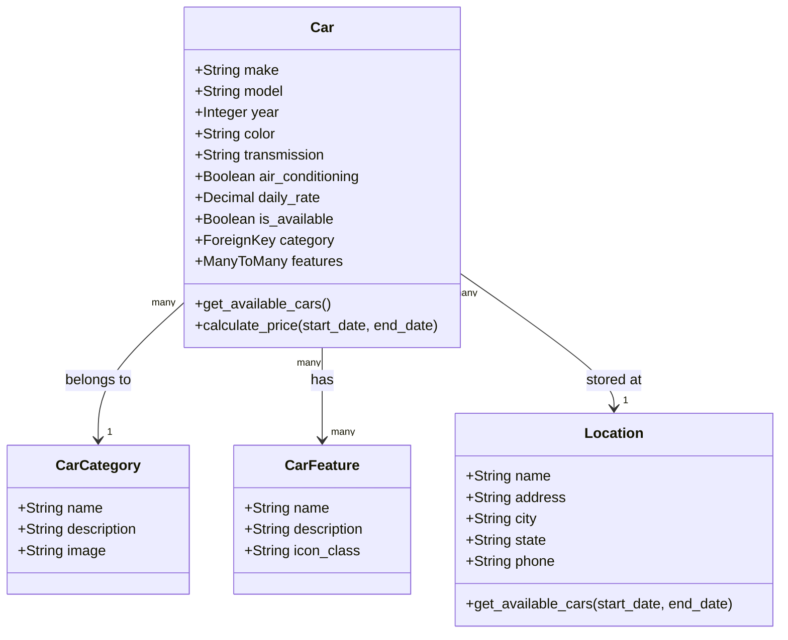
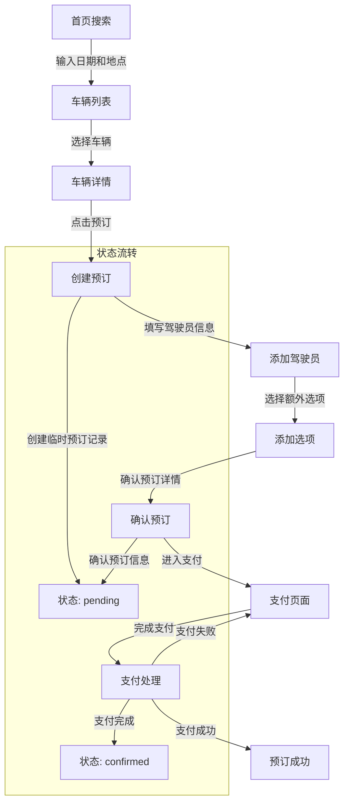

# Rush Car Rental - 车辆展示与预订流程技术文档

## 目录

1. [系统概述](#1-系统概述)
2. [车辆展示系统](#2-车辆展示系统)
   - [2.1 数据模型](#21-数据模型)
   - [2.2 展示组件](#22-展示组件)
   - [2.3 过滤与排序机制](#23-过滤与排序机制)
3. [预订流程](#3-预订流程)
   - [3.1 流程总览](#31-流程总览)
   - [3.2 状态管理](#32-状态管理)
   - [3.3 数据转换](#33-数据转换)
4. [支付集成](#4-支付集成)
   - [4.1 Stripe集成](#41-stripe集成)
   - [4.2 交易处理](#42-交易处理)
5. [用户界面实现](#5-用户界面实现)
   - [5.1 响应式设计](#51-响应式设计)
   - [5.2 组件库](#52-组件库)
6. [性能优化](#6-性能优化)
   - [6.1 查询优化](#61-查询优化)
   - [6.2 缓存策略](#62-缓存策略)
7. [安全考虑](#7-安全考虑)
8. [测试策略](#8-测试策略)

## 1. 系统概述

Rush Car Rental的车辆展示与预订系统是一个全面的客户端解决方案，使用户能够浏览、比较和预订车辆。系统基于Django框架，采用MVT (Model-View-Template)架构，集成了Bootstrap前端框架和Stripe支付处理。

本文档详细描述了车辆展示和预订的技术实现，包括数据模型、用户界面组件、工作流程和系统集成。

### 技术栈概览

```
- 后端: Django 5.x
- 前端: Bootstrap 5.x, JavaScript, Swiper.js
- 数据库: PostgreSQL (生产环境), SQLite (开发环境)
- 支付处理: Stripe API
- 缓存: Django内置缓存系统, Redis(可选)
```

## 2. 车辆展示系统

### 2.1 数据模型

车辆展示系统的核心是`Car`和相关模型。以下是主要模型及其关系:



**核心Car模型**:

```python
class Car(models.Model):
    make = models.CharField(max_length=100)
    model = models.CharField(max_length=100)
    year = models.IntegerField()
    category = models.ForeignKey(CarCategory, on_delete=models.CASCADE)
    daily_rate = models.DecimalField(max_digits=8, decimal_places=2)
    transmission = models.CharField(
        max_length=20,
        choices=[('automatic', 'Automatic'), ('manual', 'Manual')],
        default='automatic'
    )
    air_conditioning = models.BooleanField(default=True)
    is_available = models.BooleanField(default=True)
    location = models.ForeignKey(Location, on_delete=models.CASCADE)
    features = models.ManyToManyField(CarFeature, blank=True)
    
    def __str__(self):
        return f"{self.year} {self.make} {self.model}"
    
    @staticmethod
    def get_available_cars(location, start_date, end_date):
        """查询指定地点和日期范围内可用的车辆"""
        # 基本逻辑：查找在指定日期范围内没有被预订的车辆
        booked_cars = Booking.objects.filter(
            Q(pickup_location=location) | Q(dropoff_location=location),
            Q(pickup_date__lte=end_date, return_date__gte=start_date),
            status__in=['pending', 'confirmed']
        ).values_list('car_id', flat=True)
        
        return Car.objects.filter(
            location=location, 
            is_available=True
        ).exclude(id__in=booked_cars)
    
    def calculate_price(self, start_date, end_date):
        """计算指定日期范围内的租车总价"""
        days = (end_date - start_date).days
        return self.daily_rate * days
```

### 2.2 展示组件

车辆展示系统包含多个关键组件:

#### 2.2.1 车辆列表页

**View实现**:

```python
def car_list(request):
    """显示所有可用车辆，支持过滤和分页"""
    # 获取过滤参数
    category = request.GET.get('category')
    location = request.GET.get('location')
    start_date_str = request.GET.get('start_date')
    end_date_str = request.GET.get('end_date')
    
    # 基本查询集
    cars = Car.objects.filter(is_available=True)
    
    # 应用过滤条件
    if category:
        cars = cars.filter(category__id=category)
    
    if location:
        cars = cars.filter(location__id=location)
    
    # 日期过滤处理
    if start_date_str and end_date_str:
        try:
            start_date = datetime.strptime(start_date_str, '%Y-%m-%d').date()
            end_date = datetime.strptime(end_date_str, '%Y-%m-%d').date()
            
            # 获取在指定日期范围内可用的车辆
            cars = Car.get_available_cars(location, start_date, end_date)
        except ValueError:
            # 日期格式错误处理
            pass
    
    # 获取所有类别和地点用于过滤器
    categories = CarCategory.objects.all()
    locations = Location.objects.all()
    
    # 分页处理
    paginator = Paginator(cars, 9)  # 每页9辆车
    page_number = request.GET.get('page')
    page_obj = paginator.get_page(page_number)
    
    context = {
        'page_obj': page_obj,
        'categories': categories,
        'locations': locations,
        'selected_category': category,
        'selected_location': location,
        'start_date': start_date_str,
        'end_date': end_date_str,
    }
    
    return render(request, 'cars/car_list.html', context)
```

#### 2.2.2 车辆详情页

**View实现**:

```python
def car_detail(request, car_id):
    """显示单个车辆的详细信息和预订选项"""
    car = get_object_or_404(Car, id=car_id)
    
    # 获取URL参数中的日期(如果有)
    start_date_str = request.GET.get('start_date')
    end_date_str = request.GET.get('end_date')
    pickup_location_id = request.GET.get('pickup_location')
    dropoff_location_id = request.GET.get('dropoff_location')
    
    # 初始化变量
    start_date = None
    end_date = None
    pickup_location = None
    dropoff_location = None
    rental_days = 0
    total_price = 0
    
    # 处理日期和地点参数
    if start_date_str and end_date_str:
        try:
            start_date = datetime.strptime(start_date_str, '%Y-%m-%d').date()
            end_date = datetime.strptime(end_date_str, '%Y-%m-%d').date()
            rental_days = (end_date - start_date).days
            total_price = car.daily_rate * rental_days
        except ValueError:
            # 日期格式错误处理
            pass
    
    if pickup_location_id:
        pickup_location = get_object_or_404(Location, id=pickup_location_id)
    
    if dropoff_location_id:
        dropoff_location = get_object_or_404(Location, id=dropoff_location_id)
    else:
        dropoff_location = pickup_location
    
    # 获取相似车辆推荐
    similar_cars = Car.objects.filter(
        category=car.category,
        is_available=True
    ).exclude(id=car.id)[:3]
    
    # 组装上下文
    context = {
        'car': car,
        'similar_cars': similar_cars,
        'start_date': start_date,
        'end_date': end_date,
        'pickup_location': pickup_location,
        'dropoff_location': dropoff_location,
        'rental_days': rental_days,
        'total_price': total_price,
        'locations': Location.objects.all(),
    }
    
    return render(request, 'cars/car_detail.html', context)
```

### 2.3 过滤与排序机制

车辆搜索和过滤功能是提升用户体验的关键。以下是核心实现:

#### 2.3.1 搜索与过滤表单

```html
<!-- 车辆搜索表单示例 -->
<form method="get" action="" class="car-search-form">
  <div class="row g-3">
    <div class="col-md-3">
      <label for="location" class="form-label">取车地点</label>
      <select name="location" id="location" class="form-select">
        <option value="">-- 选择地点 --</option>
        
          <option value="{{ location.id }}" selected>
            {{ location.name }}
          </option>
        
      </select>
    </div>
    
    <div class="col-md-3">
      <label for="start_date" class="form-label">取车日期</label>
      <input type="date" name="start_date" id="start_date" class="form-control" 
             value="{{ start_date }}" min="{{ today|date:'Y-m-d' }}" required>
    </div>
    
    <div class="col-md-3">
      <label for="end_date" class="form-label">还车日期</label>
      <input type="date" name="end_date" id="end_date" class="form-control" 
             value="{{ end_date }}" min="{{ tomorrow|date:'Y-m-d' }}" required>
    </div>
    
    <div class="col-md-3">
      <label for="category" class="form-label">车辆类型</label>
      <select name="category" id="category" class="form-select">
        <option value="">所有类型</option>
        
          <option value="{{ category.id }}" selected>
            {{ category.name }}
          </option>
        
      </select>
    </div>
    
    <div class="col-12 text-center mt-4">
      <button type="submit" class="btn btn-warning px-5">搜索可用车辆</button>
    </div>
  </div>
</form>
```

#### 2.3.2 后端过滤逻辑增强

为了进一步优化车辆过滤，我们可以添加更高级的过滤选项:

```python
def car_list(request):
    """显示所有可用车辆，支持高级过滤和排序"""
    # 基础过滤参数
    category = request.GET.get('category')
    location = request.GET.get('location')
    start_date_str = request.GET.get('start_date')
    end_date_str = request.GET.get('end_date')
    
    # 高级过滤参数
    transmission = request.GET.get('transmission')
    min_price = request.GET.get('min_price')
    max_price = request.GET.get('max_price')
    air_conditioning = request.GET.get('air_conditioning')
    sort_by = request.GET.get('sort', 'price_asc')  # 默认按价格升序排序
    
    # 基本查询集
    cars = Car.objects.filter(is_available=True)
    
    # 应用基础过滤条件
    if category:
        cars = cars.filter(category__id=category)
    
    if location:
        cars = cars.filter(location__id=location)
    
    # 应用高级过滤条件
    if transmission:
        cars = cars.filter(transmission=transmission)
    
    if air_conditioning:
        cars = cars.filter(air_conditioning=True)
    
    if min_price:
        cars = cars.filter(daily_rate__gte=min_price)
    
    if max_price:
        cars = cars.filter(daily_rate__lte=max_price)
    
    # 日期过滤处理
    if start_date_str and end_date_str:
        try:
            start_date = datetime.strptime(start_date_str, '%Y-%m-%d').date()
            end_date = datetime.strptime(end_date_str, '%Y-%m-%d').date()
            
            # 获取在指定日期范围内可用的车辆
            booked_cars = Booking.objects.filter(
                Q(pickup_date__lte=end_date, return_date__gte=start_date),
                status__in=['pending', 'confirmed']
            ).values_list('car_id', flat=True)
            
            cars = cars.exclude(id__in=booked_cars)
        except ValueError:
            # 日期格式错误处理
            pass
    
    # 应用排序
    if sort_by == 'price_asc':
        cars = cars.order_by('daily_rate')
    elif sort_by == 'price_desc':
        cars = cars.order_by('-daily_rate')
    elif sort_by == 'newest':
        cars = cars.order_by('-year')
    elif sort_by == 'popularity':
        # 按预订次数排序，需要添加额外的查询
        car_booking_counts = Booking.objects.filter(
            car__in=cars
        ).values('car').annotate(count=Count('car')).order_by('-count')
        
        car_ids_ordered = [item['car'] for item in car_booking_counts]
        # 添加未预订过的车辆
        all_car_ids = list(cars.values_list('id', flat=True))
        remaining_ids = [id for id in all_car_ids if id not in car_ids_ordered]
        car_ids_ordered.extend(remaining_ids)
        
        # 使用Case进行排序
        preserved_order = Case(
            *[When(id=id, then=pos) for pos, id in enumerate(car_ids_ordered)]
        )
        cars = cars.order_by(preserved_order)
    
    # 获取所有类别和地点用于过滤器
    categories = CarCategory.objects.all()
    locations = Location.objects.all()
    
    # 分页处理
    paginator = Paginator(cars, 9)  # 每页9辆车
    page_number = request.GET.get('page')
    page_obj = paginator.get_page(page_number)
    
    context = {
        'page_obj': page_obj,
        'categories': categories,
        'locations': locations,
        'selected_category': category,
        'selected_location': location,
        'start_date': start_date_str,
        'end_date': end_date_str,
        'transmission': transmission,
        'min_price': min_price,
        'max_price': max_price,
        'air_conditioning': air_conditioning,
        'sort_by': sort_by,
    }
    
    return render(request, 'cars/car_list.html', context)
```

## 3. 预订流程

### 3.1 流程总览

预订流程是系统的核心功能之一，涉及多个步骤和数据转换。下图展示了完整的预订流程:



### 3.2 状态管理

预订状态管理是系统的重要组成部分，确保数据一致性和业务逻辑正确性。

**Booking模型中的状态定义**:

```python
class Booking(models.Model):
    STATUS_CHOICES = [
        ('pending', 'Pending'),
        ('confirmed', 'Confirmed'),
        ('cancelled', 'Cancelled'),
        ('completed', 'Completed'),
    ]
    
    user = models.ForeignKey(User, on_delete=models.CASCADE)
    car = models.ForeignKey(Car, on_delete=models.CASCADE)
    pickup_location = models.ForeignKey(Location, on_delete=models.CASCADE, related_name='pickup_bookings')
    dropoff_location = models.ForeignKey(Location, on_delete=models.CASCADE, related_name='dropoff_bookings')
    pickup_date = models.DateField()
    return_date = models.DateField()
    booking_date = models.DateTimeField(auto_now_add=True)
    status = models.CharField(max_length=20, choices=STATUS_CHOICES, default='pending')
    total_cost = models.DecimalField(max_digits=10, decimal_places=2)
    driver_age = models.PositiveIntegerField()
    
    # 附加选项
    damage_waiver = models.BooleanField(default=False)
    extended_area = models.BooleanField(default=False)
    satellite_navigation = models.BooleanField(default=False)
    child_seats = models.PositiveIntegerField(default=0)
    additional_drivers = models.PositiveIntegerField(default=0)
    
    def __str__(self):
        return f"Booking #{self.id} - {self.user.username}"
    
    def duration_days(self):
        """计算租期天数"""
        return (self.return_date - self.pickup_date).days
    
    def options_cost(self):
        """计算附加选项费用"""
        options_total = 0
        days = self.duration_days()
        
        # 示例计算逻辑，实际应从选项表获取价格
        if self.damage_waiver:
            options_total += 15 * days  # 每天15元损坏减免费
        
        if self.extended_area:
            options_total += 20 * days  # 每天20元扩展区域费用
            
        if self.satellite_navigation:
            options_total += 10 * days  # 每天10元导航系统
            
        options_total += self.child_seats * 8 * days  # 每个儿童座椅每天8元
        options_total += self.additional_drivers * 10 * days  # 每位额外驾驶员每天10元
        
        return Decimal(options_total)
```

### 3.3 数据转换

预订流程中的数据转换是确保用户体验流畅和数据完整性的关键。以下是关键的数据转换逻辑:

#### 3.3.1 创建预订

```python
def create_booking(request, car_id):
    """创建新的预订记录"""
    car = get_object_or_404(Car, id=car_id)
    
    if request.method == 'POST':
        form = BookingForm(request.POST)
        if form.is_valid():
            # 创建但不保存预订实例
            booking = form.save(commit=False)
            booking.user = request.user
            booking.car = car
            
            # 计算租期天数和基本价格
            pickup_date = booking.pickup_date
            return_date = booking.return_date
            days = (return_date - pickup_date).days
            
            if days < 1:
                form.add_error('return_date', '还车日期必须晚于取车日期')
                return render(request, 'bookings/create_booking.html', {'form': form, 'car': car})
            
            # 设置基本价格
            booking.total_cost = car.daily_rate * days
            
            # 保存预订记录
            booking.save()
            
            # 重定向到下一步：添加驾驶员信息
            return redirect('add_drivers', temp_booking_id=booking.id)
    else:
        # 从URL参数获取初始值
        initial_data = {}
        
        pickup_location = request.GET.get('pickup_location')
        dropoff_location = request.GET.get('dropoff_location', pickup_location)
        pickup_date = request.GET.get('pickup_date')
        return_date = request.GET.get('return_date')
        driver_age = request.GET.get('driver_age', 30)  # 默认30岁
        
        if pickup_location:
            initial_data['pickup_location'] = pickup_location
        
        if dropoff_location:
            initial_data['dropoff_location'] = dropoff_location
        
        if pickup_date:
            try:
                initial_data['pickup_date'] = datetime.strptime(pickup_date, '%Y-%m-%d').date()
            except ValueError:
                pass
        
        if return_date:
            try:
                initial_data['return_date'] = datetime.strptime(return_date, '%Y-%m-%d').date()
            except ValueError:
                pass
        
        if driver_age:
            initial_data['driver_age'] = driver_age
        
        form = BookingForm(initial=initial_data)
    
    return render(request, 'bookings/create_booking.html', {'form': form, 'car': car})
```

#### 3.3.2 添加驾驶员信息

```python
def add_drivers(request, temp_booking_id):
    """添加驾驶员信息页面"""
    booking = get_object_or_404(Booking, id=temp_booking_id, user=request.user, status='pending')
    
    # 检查用户是否已有保存的驾驶员信息
    existing_drivers = []
    if hasattr(request.user, 'profile'):
        existing_drivers = request.user.profile.drivers.all()
    
    if request.method == 'POST':
        # 处理表单提交
        action = request.POST.get('action', '')
        
        if action == 'use_existing':
            # 使用现有驾驶员
            driver_id = request.POST.get('driver_id')
            if driver_id:
                driver = get_object_or_404(Driver, id=driver_id)
                # 创建驾驶员副本关联到本次预订
                booking_driver = Driver.objects.create(
                    first_name=driver.first_name,
                    last_name=driver.last_name,
                    email=driver.email,
                    date_of_birth=driver.date_of_birth,
                    license_number=driver.license_number,
                    license_issued_in=driver.license_issued_in,
                    license_expiry_date=driver.license_expiry_date,
                    license_is_lifetime=driver.license_is_lifetime,
                    address=driver.address,
                    local_address=driver.local_address,
                    city=driver.city,
                    state=driver.state,
                    postcode=driver.postcode,
                    country_of_residence=driver.country_of_residence,
                    phone=driver.phone,
                    mobile=driver.mobile,
                    fax=driver.fax,
                    occupation=driver.occupation,
                    is_primary=True,
                    booking=booking
                )
                
                # 继续到下一步
                return redirect('add_options', temp_booking_id=booking.id)
        
        elif action == 'add_new':
            # 添加新驾驶员
            form = DriverForm(request.POST)
            if form.is_valid():
                driver = form.save(commit=False)
                driver.booking = booking
                driver.is_primary = True
                driver.save()
                
                # 询问是否保存到用户资料
                save_to_profile = request.POST.get('save_to_profile') == 'on'
                if save_to_profile and hasattr(request.user, 'profile'):
                    # 创建一个新的驾驶员记录用于用户资料
                    profile_driver = Driver.objects.create(
                        first_name=driver.first_name,
                        last_name=driver.last_name,
                        email=driver.email,
                        date_of_birth=driver.date_of_birth,
                        license_number=driver.license_number,
                        license_issued_in=driver.license_issued_in,
                        license_expiry_date=driver.license_expiry_date,
                        license_is_lifetime=driver.license_is_lifetime,
                        address=driver.address,
                        local_address=driver.local_address,
                        city=driver.city,
                        state=driver.state,
                        postcode=driver.postcode,
                        country_of_residence=driver.country_of_residence,
                        phone=driver.phone,
                        mobile=driver.mobile,
                        fax=driver.fax,
                        occupation=driver.occupation,
                        is_primary=request.POST.get('set_as_primary') == 'on',
                    )
                    request.user.profile.drivers.add(profile_driver)
                
                # 继续到下一步
                return redirect('add_options', temp_booking_id=booking.id)
            
            # 表单验证失败，返回错误信息
            context = {
                'booking': booking,
                'form': form,
                'existing_drivers': existing_drivers,
            }
            return render(request, 'bookings/drivers.html', context)
    
    # GET请求，显示驾驶员选择页面
    context = {
        'booking': booking,
        'form': DriverForm(),
        'existing_drivers': existing_drivers,
    }
    return render(request, 'bookings/drivers.html', context)
```

#### 3.3.3 添加预订选项

```python
def add_options(request, temp_booking_id):
    """添加预订附加选项"""
    booking = get_object_or_404(Booking, id=temp_booking_id, user=request.user, status='pending')
    rental_days = booking.duration_days()
    base_cost = booking.car.daily_rate * rental_days
    
    # 获取所有可用选项
    damage_waiver_price = 15 * rental_days  # 每天15元
    extended_area_price = 20 * rental_days  # 每天20元
    navigation_price = 10 * rental_days     # 每天10元
    child_seat_price = 8 * rental_days      # 每个座椅每天8元
    additional_driver_price = 10 * rental_days  # 每位额外驾驶员每天10元
    
    if request.method == 'POST':
        # 处理选项表单提交
        booking.damage_waiver = request.POST.get('damage_waiver') == 'on'
        booking.extended_area = request.POST.get('extended_area') == 'on'
        booking.satellite_navigation = request.POST.get('satellite_navigation') == 'on'
        
        try:
            booking.child_seats = int(request.POST.get('child_seats', 0))
        except ValueError:
            booking.child_seats = 0
            
        try:
            booking.additional_drivers = int(request.POST.get('additional_drivers', 0))
        except ValueError:
            booking.additional_drivers = 0
        
        # 重新计算总价
        options_cost = booking.options_cost()
        booking.total_cost = base_cost + options_cost
        booking.save()
        
        # 继续到确认页面
        return redirect('confirm_booking', temp_booking_id=booking.id)
    
    # 计算当前配置的总价
    current_options_cost = booking.options_cost()
    total_cost = base_cost + current_options_cost
    
    context = {
        'booking': booking,
        'rental_days': rental_days,
        'base_cost': base_cost,
        'total_cost': total_cost,
        'damage_waiver_price': damage_waiver_price,
        'extended_area_price': extended_area_price,
        'navigation_price': navigation_price,
        'child_seat_price': child_seat_price,
        'additional_driver_price': additional_driver_price,
    }
    return render(request, 'bookings/options.html', context)
```

#### 3.3.4 确认预订

```python
def confirm_booking(request, temp_booking_id):
    """确认预订信息页面"""
    booking = get_object_or_404(Booking, id=temp_booking_id, user=request.user, status='pending')
    rental_days = booking.duration_days()
    base_cost = booking.car.daily_rate * rental_days
    options_cost = booking.options_cost()
    
    # 获取预订的主驾驶员
    primary_driver = booking.drivers.filter(is_primary=True).first()
    
    if request.method == 'POST':
        # 用户已确认预订，进入支付流程
        return redirect('payment', temp_booking_id=booking.id)
    
    context = {
        'booking': booking,
        'primary_driver': primary_driver,
        'rental_days': rental_days,
        'base_cost': base_cost,
        'options_cost': options_cost,
        'total_cost': booking.total_cost,
    }
    return render(request, 'bookings/confirm.html', context)
```

## 4. 支付集成

### 4.1 Stripe集成

Rush Car Rental使用Stripe作为支付处理服务。以下是核心集成代码:

```python
def payment(request, temp_booking_id):
    """支付页面"""
    booking = get_object_or_404(Booking, id=temp_booking_id, user=request.user, status='pending')
    
    # 检查是否已经创建了支付意向
    payment_intent_id = request.session.get(f'payment_intent_{booking.id}')
    client_secret = None
    
    try:
        if payment_intent_id:
            # 检索现有支付意向
            intent = stripe.PaymentIntent.retrieve(payment_intent_id)
            client_secret = intent.client_secret
        else:
            # 创建新的支付意向
            intent = stripe.PaymentIntent.create(
                amount=int(booking.total_cost * 100),  # 转换为分
                currency='cny',
                metadata={
                    'booking_id': booking.id,
                    'user_id': request.user.id,
                }
            )
            client_secret = intent.client_secret
            
            # 保存支付意向ID到会话
            request.session[f'payment_intent_{booking.id}'] = intent.id
    except Exception as e:
        messages.error(request, f"支付初始化失败: {str(e)}")
        return redirect('confirm_booking', temp_booking_id=booking.id)
    
    context = {
        'booking': booking,
        'client_secret': client_secret,
        'stripe_public_key': settings.STRIPE_PUBLIC_KEY,
    }
    return render(request, 'bookings/payment.html', context)
```

### 4.2 交易处理

支付成功后需要处理订单状态更新和通知:

```python
def process_payment(request, temp_booking_id):
    """处理支付结果"""
    booking = get_object_or_404(Booking, id=temp_booking_id, user=request.user)
    
    if request.method == 'POST':
        payment_intent_id = request.POST.get('payment_intent_id')
        
        try:
            # 验证支付状态
            intent = stripe.PaymentIntent.retrieve(payment_intent_id)
            
            if intent.status == 'succeeded':
                # 支付成功，更新预订状态
                booking.status = 'confirmed'
                booking.save()
                
                # 清理会话数据
                if f'payment_intent_{booking.id}' in request.session:
                    del request.session[f'payment_intent_{booking.id}']
                
                # 发送确认邮件
                send_booking_confirmation_email(booking)
                
                messages.success(request, "支付成功，您的预订已确认！")
                return redirect('booking_success', booking_id=booking.id)
            else:
                messages.error(request, f"支付未完成，状态: {intent.status}")
                return redirect('payment', temp_booking_id=booking.id)
                
        except Exception as e:
            messages.error(request, f"处理支付时出错: {str(e)}")
            return redirect('payment', temp_booking_id=booking.id)
    
    return redirect('payment', temp_booking_id=booking.id)
```

## 5. 用户界面实现

### 5.1 响应式设计

Rush Car Rental的用户界面采用响应式设计，确保在各种设备上提供良好的用户体验。以下是核心CSS和JS实现:

```html
<!-- 基本响应式布局结构示例 -->
<div class="container">
  <div class="row">
    <!-- 在大屏幕上显示为3列，中等屏幕2列，小屏幕1列 -->
    <div class="col-lg-4 col-md-6 col-12 mb-4">
      <!-- 车辆卡片 -->
      <div class="card h-100">
        
        <div class="card-body">
          <h5 class="card-title">{{ car.year }} {{ car.make }} {{ car.model }}</h5>
          <div class="car-features mb-3">
            <span class="feature-item"><i class="fas fa-cog"></i> {{ car.get_transmission_display }}</span>
            <span class="feature-item"><i class="fas fa-snowflake"></i> 有空调无空调</span>
            <span class="feature-item"><i class="fas fa-users"></i> {{ car.seats }}座</span>
          </div>
          <div class="price-tag">
            <div class="price-label">每日租金</div>
            <div class="price">￥{{ car.daily_rate }}</div>
          </div>
        </div>
        <div class="card-footer bg-white border-top-0">
          <a href="" class="btn btn-outline-warning w-100">查看详情</a>
        </div>
      </div>
    </div>
    <!-- 更多车辆卡片 -->
  </div>
</div>
```

### 5.2 组件库

为了保持UI设计的一致性，我们定义了一系列可复用的组件:

#### 5.2.1 搜索表单组件

```html

```

```html
<!-- components/search_form.html -->
<div class="search-form-container bg-light p-4 rounded mb-4">
  <form method="get" action="" class="car-search-form">
    <div class="row g-3">
      <div class="col-md-3">
        <label for="location" class="form-label">取车地点</label>
        <div class="location-select">
          <i class="fas fa-map-marker-alt location-icon"></i>
          <select name="location" id="location" class="form-select">
            <option value="">-- 选择地点 --</option>
            
              <option value="{{ loc.id }}" selected>
                {{ loc.name }}
              </option>
            
          </select>
          <i class="fas fa-chevron-down dropdown-icon"></i>
        </div>
      </div>
      
      <div class="col-md-3">
        <label for="start_date" class="form-label">取车日期</label>
        <div class="date-time-select">
          <div class="date-select">
            <i class="fas fa-calendar-alt date-icon"></i>
            <input type="date" name="start_date" id="start_date" class="form-control" 
                   value="{{ start_date }}" min="{{ today|date:'Y-m-d' }}" required>
          </div>
          <div class="time-select">
            <select name="pickup_time" class="form-select">
              
                <option value="{{ hour }}">{{ hour }}</option>
              
            </select>
          </div>
        </div>
      </div>
      
      <div class="col-md-3">
        <label for="end_date" class="form-label">还车日期</label>
        <div class="date-time-select">
          <div class="date-select">
            <i class="fas fa-calendar-alt date-icon"></i>
            <input type="date" name="end_date" id="end_date" class="form-control" 
                   value="{{ end_date }}" min="{{ tomorrow|date:'Y-m-d' }}" required>
          </div>
          <div class="time-select">
            <select name="return_time" class="form-select">
              
                <option value="{{ hour }}">{{ hour }}</option>
              
            </select>
          </div>
        </div>
      </div>
      
      <div class="col-md-3">
        <label for="driver_age" class="form-label">驾驶员年龄</label>
        <input type="number" name="driver_age" id="driver_age" class="form-control" 
               min="18" max="99" value="{{ driver_age|default:'30' }}" required>
      </div>
      
      <div class="col-12 text-center mt-4">
        <button type="submit" class="select-car-btn">
          <i class="fas fa-search me-2"></i> 搜索可用车辆
        </button>
      </div>
    </div>
  </form>
</div>
```

#### 5.2.2 车辆卡片组件

```html

```

```html
<!-- components/car_card.html -->
<div class="card h-100 car-card">
  
  
  <div class="category-badge">{{ car.category.name }}</div>
  
  <div class="card-body">
    <h5 class="card-title">{{ car.year }} {{ car.make }} {{ car.model }}</h5>
    
    <div class="car-features mb-3">
      <span class="feature-item"><i class="fas fa-cog"></i> {{ car.get_transmission_display }}</span>
      <span class="feature-item"><i class="fas fa-snowflake"></i> 有空调无空调</span>
      <span class="feature-item"><i class="fas fa-users"></i> {{ car.seats }}座</span>
    </div>
    
    
    <div class="price-comparison mb-2">
      <span class="competitor-price">￥{{ car.competitor_price|default:car.daily_rate|add:50 }}</span>
      <span class="savings-badge">省{{ car.competitor_price|default:car.daily_rate|add:50|sub:car.daily_rate }}元/天</span>
    </div>
    
    
    <div class="price-tag">
      <div class="price-label">每日租金</div>
      <div class="price">￥{{ car.daily_rate }}</div>
    </div>
  </div>
  
  <div class="card-footer bg-white border-top-0 d-flex justify-content-between">
    <a href="?start_date={{ start_date }}&end_date={{ end_date }}&pickup_location={{ selected_location }}" class="btn btn-outline-warning flex-grow-1 me-2">查看详情</a>
    
    
    <a href="?start_date={{ start_date }}&end_date={{ end_date }}&pickup_location={{ selected_location }}" class="btn btn-warning flex-grow-1">立即预订</a>
    
  </div>
</div>
```

## 6. 性能优化

### 6.1 查询优化

要提高系统性能，特别是车辆列表页的加载速度，我们实现了以下查询优化:

```python
# 优化的车辆列表查询
def car_list(request):
    """显示所有可用车辆，使用优化的查询"""
    # 基础过滤参数
    category = request.GET.get('category')
    location = request.GET.get('location')
    start_date_str = request.GET.get('start_date')
    end_date_str = request.GET.get('end_date')
    
    # 基本查询集，使用select_related和prefetch_related减少数据库查询
    cars = Car.objects.select_related('category', 'location').prefetch_related('features')
    
    # 应用过滤条件
    if category:
        cars = cars.filter(category__id=category)
    
    if location:
        cars = cars.filter(location__id=location)
    
    # 日期过滤，使用子查询而非多次查询
    if start_date_str and end_date_str:
        try:
            start_date = datetime.strptime(start_date_str, '%Y-%m-%d').date()
            end_date = datetime.strptime(end_date_str, '%Y-%m-%d').date()
            
            # 使用子查询找出已预订的车辆ID
            booked_cars_subquery = Booking.objects.filter(
                Q(pickup_date__lte=end_date, return_date__gte=start_date),
                status__in=['pending', 'confirmed']
            ).values('car_id')
            
            cars = cars.exclude(id__in=Subquery(booked_cars_subquery))
        except ValueError:
            pass
    
    # 分页处理
    paginator = Paginator(cars, 9)  # 每页9辆车
    page_number = request.GET.get('page')
    page_obj = paginator.get_page(page_number)
    
    context = {
        'page_obj': page_obj,
        'categories': CarCategory.objects.all(),
        'locations': Location.objects.all(),
        'selected_category': category,
        'selected_location': location,
        'start_date': start_date_str,
        'end_date': end_date_str,
    }
    
    return render(request, 'cars/car_list.html', context)
```

### 6.2 缓存策略

为了进一步提高性能，我们实现了以下缓存策略:

```python
# 使用Django缓存框架缓存车辆列表
from django.core.cache import cache
from django.utils.cache import get_cache_key
from django.views.decorators.cache import cache_page

@cache_page(60 * 15)  # 缓存15分钟
def car_list(request):
    """缓存的车辆列表视图"""
    # 函数内容同上...
```

对于不常变动的数据，比如车辆类别和位置列表，使用模板片段缓存:

```html



<div class="category-filter">
  <h4>车辆类型</h4>
  <div class="list-group">
    
    <a href="?category={{ category.id }}" class="list-group-item active">
      {{ category.name }}
    </a>
    
  </div>
</div>

```

## 7. 安全考虑

安全性是系统设计的重要方面，特别是在处理支付和个人信息时。关键的安全措施包括:

1. **CSRF保护**：所有表单都包含Django的CSRF令牌
2. **输入验证**：严格验证所有用户输入
3. **权限检查**：确保用户只能访问自己的预订和相关数据
4. **支付数据处理**：所有支付处理由Stripe处理，敏感数据不经过我们的服务器
5. **HTTPS**：所有通信必须通过HTTPS加密

示例权限检查代码:

```python
def booking_detail(request, booking_id):
    """预订详情页面，验证用户权限"""
    # 获取预订并确保当前用户是所有者
    booking = get_object_or_404(Booking, id=booking_id)
    
    # 权限检查
    if booking.user != request.user and not request.user.is_staff:
        messages.error(request, "您无权查看此预订信息")
        return redirect('user_bookings')
    
    # 显示预订详情
    context = {
        'booking': booking,
        'primary_driver': booking.drivers.filter(is_primary=True).first(),
    }
    return render(request, 'bookings/booking_detail.html', context)
```

## 8. 测试策略

全面的测试策略对于确保系统稳定性和可靠性至关重要。我们的测试策略包括:

1. **单元测试**：测试各个函数和方法
2. **集成测试**：测试各组件间的交互
3. **功能测试**：测试完整的用户流程
4. **性能测试**：测试系统在负载下的表现

示例测试代码:

```python
from django.test import TestCase, Client
from django.urls import reverse
from django.contrib.auth.models import User
from .models import Car, CarCategory, Location, Booking

class CarListViewTest(TestCase):
    """测试车辆列表视图"""
    
    def setUp(self):
        # 创建测试数据
        self.category = CarCategory.objects.create(name="Economy", description="Economy cars")
        self.location = Location.objects.create(name="Test Location", address="Test Address")
        self.car = Car.objects.create(
            make="Toyota",
            model="Corolla",
            year=2023,
            category=self.category,
            daily_rate=200.00,
            location=self.location,
            is_available=True
        )
        
        # 创建客户端
        self.client = Client()
    
    def test_car_list_view(self):
        """测试车辆列表页面加载"""
        url = reverse('car_list')
        response = self.client.get(url)
        
        self.assertEqual(response.status_code, 200)
        self.assertTemplateUsed(response, 'cars/car_list.html')
        self.assertContains(response, "Toyota Corolla")
    
    def test_car_list_filtering(self):
        """测试车辆列表过滤功能"""
        url = reverse('car_list') + f'?category={self.category.id}'
        response = self.client.get(url)
        
        self.assertEqual(response.status_code, 200)
        self.assertContains(response, "Toyota Corolla")
        
        # 创建另一个类别，确认过滤正常工作
        other_category = CarCategory.objects.create(name="Luxury", description="Luxury cars")
        other_car = Car.objects.create(
            make="BMW",
            model="7 Series",
            year=2023,
            category=other_category,
            daily_rate=800.00,
            location=self.location,
            is_available=True
        )
        
        url = reverse('car_list') + f'?category={self.category.id}'
        response = self.client.get(url)
        
        self.assertContains(response, "Toyota Corolla")
        self.assertNotContains(response, "BMW 7 Series")
```

---

本文档详细描述了Rush Car Rental的车辆展示和预订流程的技术实现。通过遵循这些指南和最佳实践，我们可以保持系统的一致性、可维护性和高性能。

## 附录

### A. 相关API文档

- [Stripe API文档](https://stripe.com/docs/api)
- [Django文档](https://docs.djangoproject.com/)